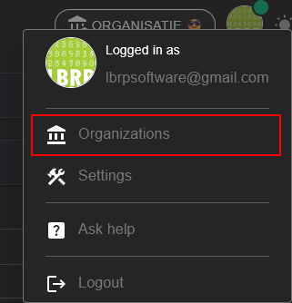
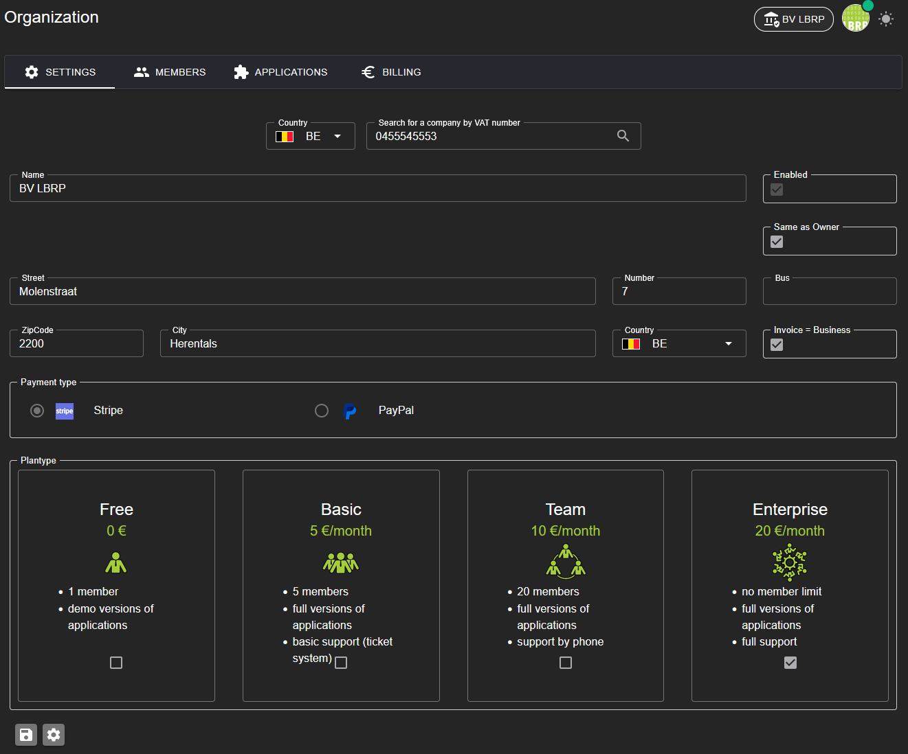

# LBRP Cloud - Identity - Organisaties

## 1. Organisatie en Gebruikersbeheer  

Ons systeem werkt op basis van organisaties. Wanneer een gebruiker een account aanmaakt, wordt automatisch een eigen organisatie aangemaakt waarvan hij/zij lid (member) is. Binnen deze organisatie kunnen diverse acties worden uitgevoerd:

1. **Applicaties toevoegen**
   - Als eigenaar van een organisatie kun je applicaties toevoegen. Deze applicaties zijn beschikbaar binnen jouw organisatie en kunnen individueel worden geactiveerd.

2. **Gebruikers uitnodigen**
   - Je kunt andere gebruikers uitnodigen om lid te worden van jouw organisatie. Uitgenodigde gebruikers krijgen toegang tot de applicaties en gegevens binnen jouw organisatie, afgestemd op hun rol en rechten.

Zo biedt het systeem volledige controle en flexibiliteit voor samenwerking binnen jouw organisatie.

## 2. Organisatie Instellingen  

In de details van een organisatie kun je de volgende instellingen beheren:

1. **Plan Selecteren**  
   - Kies een passend abonnement voor je organisatie:
     - **Free**: Basisfunctionaliteiten gratis.
     - **Basic**: Uitgebreide opties voor individuele gebruikers.
     - **Team**: Ontworpen voor teams met gedeelde toegang.
     - **Enterprise**: Voor grote organisaties met geavanceerde behoeften.

2. **Betalingswijze Instellen**  
   - Kies tussen **Stripe** of **PayPal** voor veilige betalingen.

3. **Organisatiegegevens Invullen**  
   - Voeg belangrijke gegevens van je organisatie toe, zoals het **adres**, of andere relevante details.

Hiermee zorg je ervoor dat je organisatie volledig en correct is ingesteld voor gebruik.

