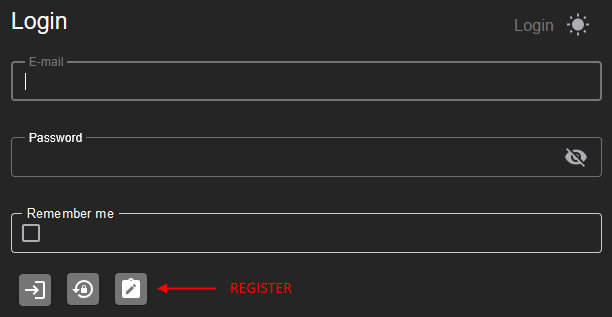
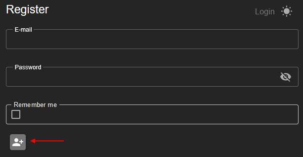

# LBRP Cloud - Identity - Gebruikers

## 1. Aanmelden

Om toegang te krijgen tot de software, kun je eenvoudig inloggen via de **Login**-knop op de startpagina. 

1. Klik op **Login**.  
2. Voer je gebruikersnaam en wachtwoord in.  
3. Optioneel: Vink de checkbox **Onthoud mij** aan als je niet telkens opnieuw wilt inloggen.  
   - **Aangevinkt**: Je blijft ingelogd, zelfs na het sluiten van de software.  
   - **Niet aangevinkt**: Je blijft slechts voor één dag ingelogd.

Na het invullen van je gegevens klik je op de **Inloggen**-knop om toegang te krijgen tot je account.

## 2. Registreren

Naast inloggen kun je je op het **Login-scherm** ook registreren voor een nieuw account. 

1. Klik op de knop **Registreren**.  
2. Vul een **gebruikersnaam** en een **wachtwoord** in.  
3. Bevestig je wachtwoord door het opnieuw in te voeren.  
4. Klik op **Registreren** om je account aan te maken.

Na succesvolle registratie kun je direct inloggen met je nieuwe accountgegevens.

## 3. Wachtwoord Vergeten

Als je je wachtwoord bent vergeten, kun je dit eenvoudig herstellen via de **Wachtwoord vergeten**-knop op het login-scherm.

1. Klik op **Wachtwoord vergeten**.  
2. Vul je geregistreerde **e-mailadres** in.  
3. Klik op de knop **OK**.  

Je ontvangt een e-mail met een link om je wachtwoord te resetten. Volg de instructies in de e-mail om een nieuw wachtwoord aan te maken.
