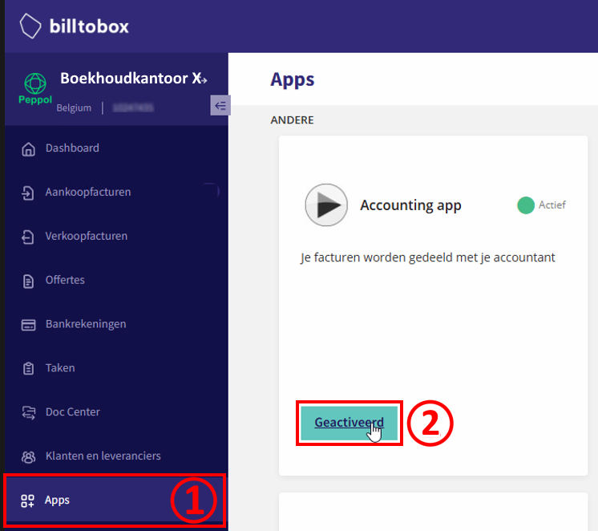
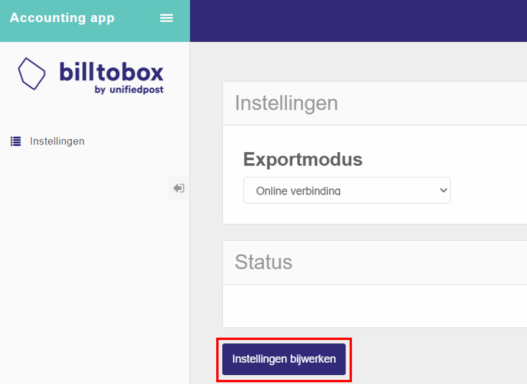
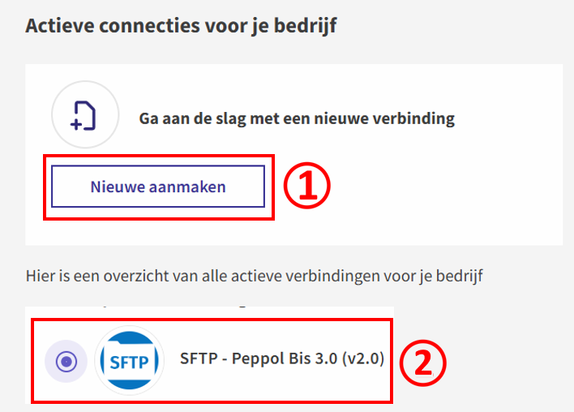
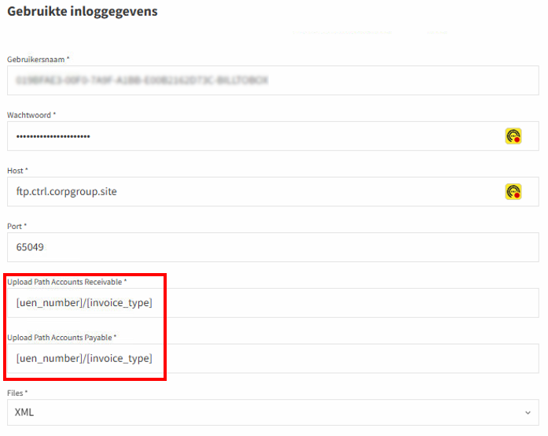
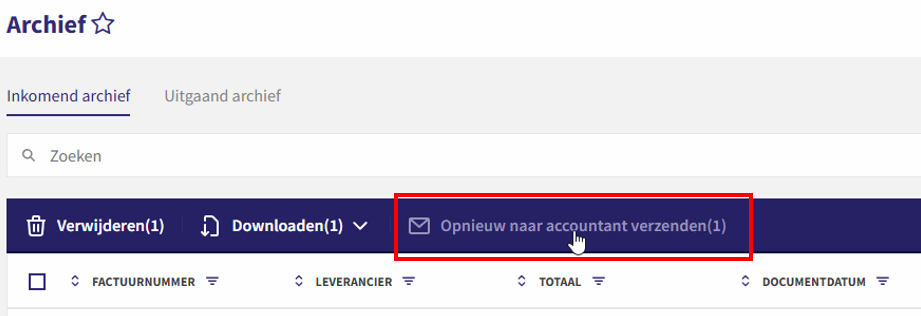
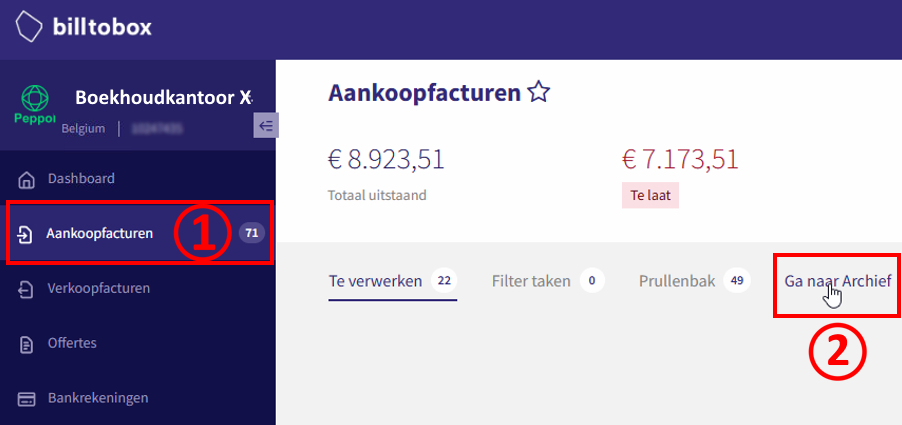

# SFTP Integratie - BillToBox

## Terug naar [Hoofdmenu](../../README.md) | [Providers Overzicht](Providers/README.md)

Volg deze stappen om BillToBox te koppelen met AccoWin SFTP.

## 1. Naar Apps/Setup Gaan
1. Log in op BillToBox.
2. Ga naar **Apps** of **Instellingen**.

## 2. FTP/SFTP Setup Configureren
1. Klik **Setup** of **FTP/Peppol integratie**.
2. Vul credentials in uit AccoWin:
   - Host: [jouw SFTP host]
   - Poort: 22
   - Gebruiker: [SFTP gebruiker]
   - Wachtwoord: [SFTP wachtwoord]
3. Stel root-map in op **BTW-nummer van het bedrijf**.

**💡 LET OP: Root-map = BTW-nummer (bijv. BE123456789). Subfolders voor UBL/CODA etc.**

## 3. Documenten Versturen
1. Selecteer documenten → **Verstuur** naar SFTP.
2. Of configureer automatische sync.

## 4. Archief Controleren
- Bekijk verzonden bestanden in **Archief**.

**💡 Wacht ~1 uur na verzenden. Download in AccoWin via UBL-menu.**

---
*Zie [04. Problemen oplossen](../../04-Troubleshooting.md) | [Andere providers](../../README.md#providers)*