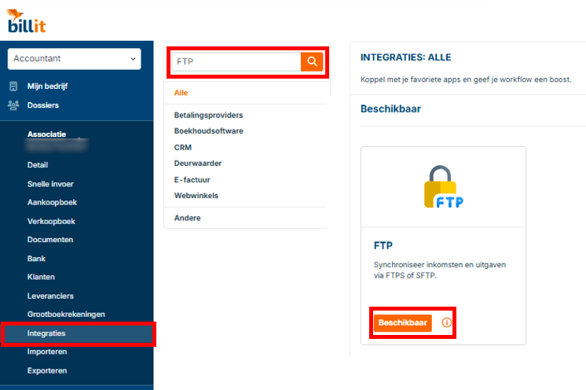
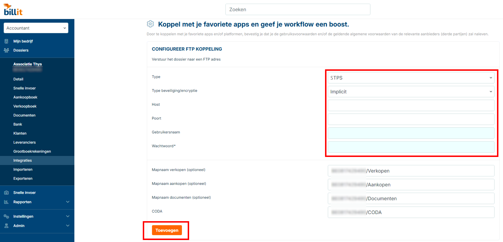
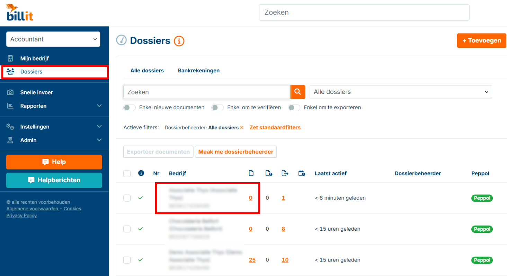

# SFTP Integratie - Bilit

## Terug naar [Hoofdmenu](../../README.md) | [Providers Overzicht](Providers/README.md)

Volg deze stappen om Bilit te koppelen met AccoWin SFTP.

## 1. Naar Integraties Gaan
1. Log in op Bilit.
2. Ga naar **Integraties** (of Instellingen > Koppelingen).

## 2. FTP-Integratie Aanmaken
1. Klik **Nieuwe FTP-verbinding** of **SFTP toevoegen**.
2. Vul credentials in uit AccoWin:
   - Host: [jouw SFTP host]
   - Poort: 22
   - Gebruiker: [SFTP gebruiker]
   - Wachtwoord: [SFTP wachtwoord]
3. Stel root-map in op **BTW-nummer van het bedrijf**.

**💡 LET OP: Root-map = BTW-nummer (bijv. BE123456789). Subfolders voor verkopen/aankopen komen eronder.**

## 3. Koppelen aan Dossier
1. Ga naar **Dossiers**.
2. Selecteer dossier → Koppel FTP-integratie.

## 4. Documenten Versturen
- Documenten in Bilit → **Verstuur naar SFTP** of automatische sync.
- Wacht ~1 uur → Download in AccoWin (**UBL > Import UBL from Cloud**).

**💡 Test met 1 factuur. Check BTW-match als geen bestanden verschijnen.**

---
*Zie [04. Problemen oplossen](../../04-Troubleshooting.md) | [Andere providers](../../README.md#providers)*