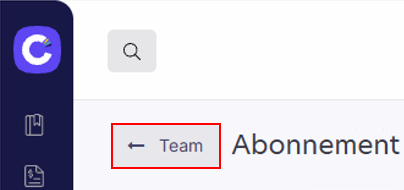
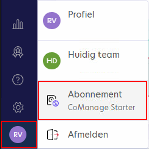
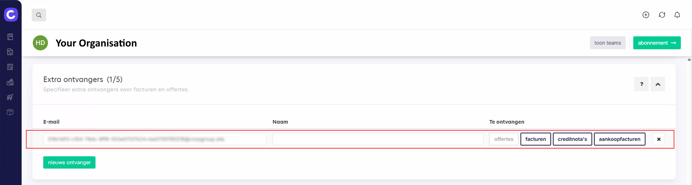

# SFTP Integratie - CoManage

## Terug naar [Hoofdmenu](../../README.md) | [Providers Overzicht](Providers/README.md)

Volg deze stappen om CoManage te koppelen met AccoWin SFTP.

## 1. Naar Team/Abonnement Gaan
1. Log in op CoManage.
2. Ga naar **Team** of **Abonnement**.

## 2. Receiver/SFTP Configureren
1. Klik **Receiver toevoegen** of **Integratie**.
2. Vul credentials in uit AccoWin:
   - Host: [jouw SFTP host]
   - Poort: 22
   - Gebruiker: [SFTP gebruiker]
   - Wachtwoord: [SFTP wachtwoord]
3. Stel root-map in op **BTW-nummer van het bedrijf**.

**💡 LET OP: Root-map = BTW-nummer (bijv. BE123456789). Subfolders voor documenten komen eronder.**

## 3. Documenten Versturen
- Configureer automatische sync of **Verstuur** handmatig.
- Wacht ~1 uur → Download in AccoWin (**UBL > Import UBL from Cloud**).

**💡 Test integratie met sample bestand. Check BTW als leeg.**

---
*Zie [04. Problemen oplossen](../../04-Troubleshooting.md) | [Andere providers](../../README.md#providers)*