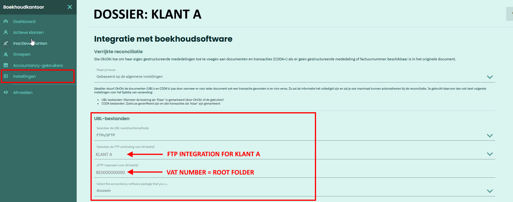
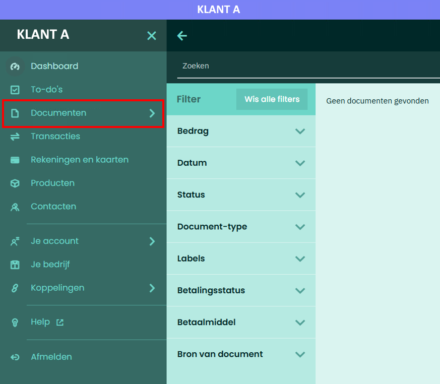

# SFTP Integratie - OkiOki

## Terug naar [Hoofdmenu](../../README.md) | [Providers Overzicht](../README.md#providers)

In **OkiOki** maak je eerst FTP-verbindingen aan, die je daarna per **Bedrijf** selecteert.

## 1. FTP-Integratie Instellen
1. Ga naar **Algemene Instellingen** van je boekhoudkantoor.
2. Klik **Voeg FTP-verbinding toe**.
   - Algemeen (alle bedrijven): Geef vrije naam.
   - Specifiek bedrijf: Naam of BTW-nummer.

3. Vul **credentials** uit AccoWin:
   - Host, poort, gebruiker, wachtwoord.

## 2. FTP-Integratie Koppelen aan Dossier
1. Ga naar **Instellingen** van een Dossier.
2. Selecteer de FTP-integratie.

**💡 LET OP: Vul in '**sFTP-mapnaam voor Bedrijf**' het **BTW-nummer** in. Subfolders (Verkopen, Aankopen, CODA) komen hieronder.**

## 3. Documenten Versturen naar SFTP
1. Ga naar bedrijf → **Documenten**.
2. Klik **Niet bij je accountant**.

3. Klik rechtsboven **Verstuur naar SFTP-server**.

**💡 LET OP: Documenten worden opgevangen en ~1x per uur in database gezet. Dan downloadbaar in AccoWin.**

**Test: Verstuur 1 document → Check AccoWin UBL-menu na 1 uur.**

---
*Zie [04. Problemen oplossen](../../04-Troubleshooting.md) | [Andere providers](../README.md#providers)*