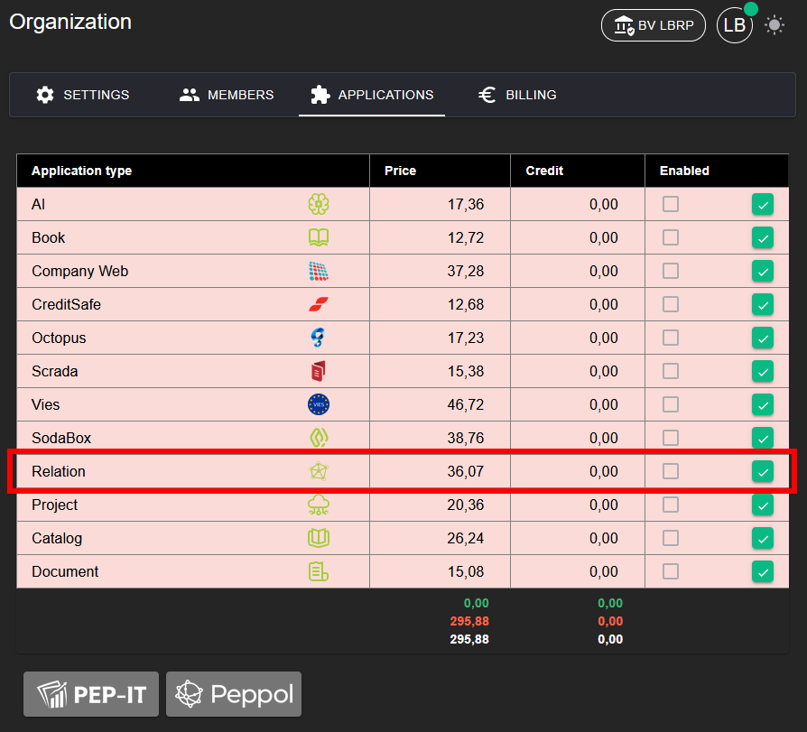
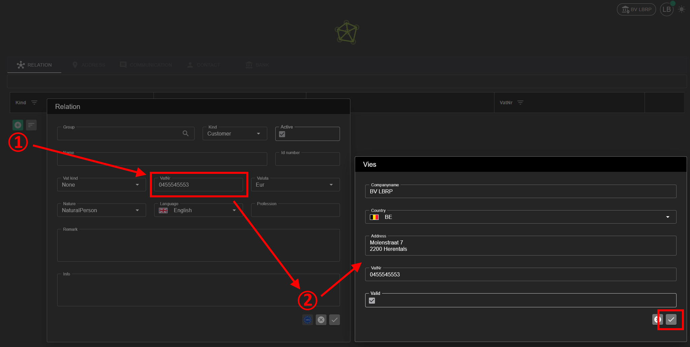

# Relation

Met de Relation applicatie kan u klanten, leveranciers of andere contacten beheren.

## 1. Applicatie Activeren

Om de **Relation** applicatie te kunnen gebruiken, moet deze eerst geactiveerd worden.

**Stappen:**
1. Ga naar **Organization → [Applications](../Identity/Applications/README.md)**.
2. Activeer de applicatie **Relation** voor uw organisatie.
3. Na activatie is het Relation-beheer beschikbaar in het menu.

## 2. Relatie Toevoegen

**Stappen:**
1. Klik op de groene **+** knop om een nieuwe relatie toe te voegen.
2. Vul de basisgegevens manueel in, of laat deze automatisch invullen indien de **Vies** applicatie actief is.
3. Sla de relatie op en selecteer deze om bijkomende gegevens verder aan te vullen.

Indien **Vies** actief is, worden naam, land en adres automatisch opgehaald op basis van het BTW-nummer.
Meer informatie hierover vindt u in de [Vies](../Vies/README.md)-handleiding:

### 2.1 Adres

Op het tabblad **Adres** kan u adressen voor de relatie beheren.

Mogelijke adressen:
- Business adres
- Optioneel: afwijkend facturatie- en leveringsadres

### 2.2 Communicatie

Op het tabblad **Communicatie** kan u communicatiekanalen toevoegen:
- E-mail
- Mobiel
- Fax
- Website

### 2.3 Contact

Op het tabblad **Contact** kan u contactpersonen voor de relatie toevoegen:

Per contactpersoon kan u volgende gegevens registreren:
- Naam
- Taal
- Opmerkingen

### 2.4 Bank gegevens

Op het tabblad **Bank** kan u bankgegevens voor de relatie toevoegen:

Te registreren gegevens:
- Banknaam
- Rekeningnummer
- IBAN
- BIC
