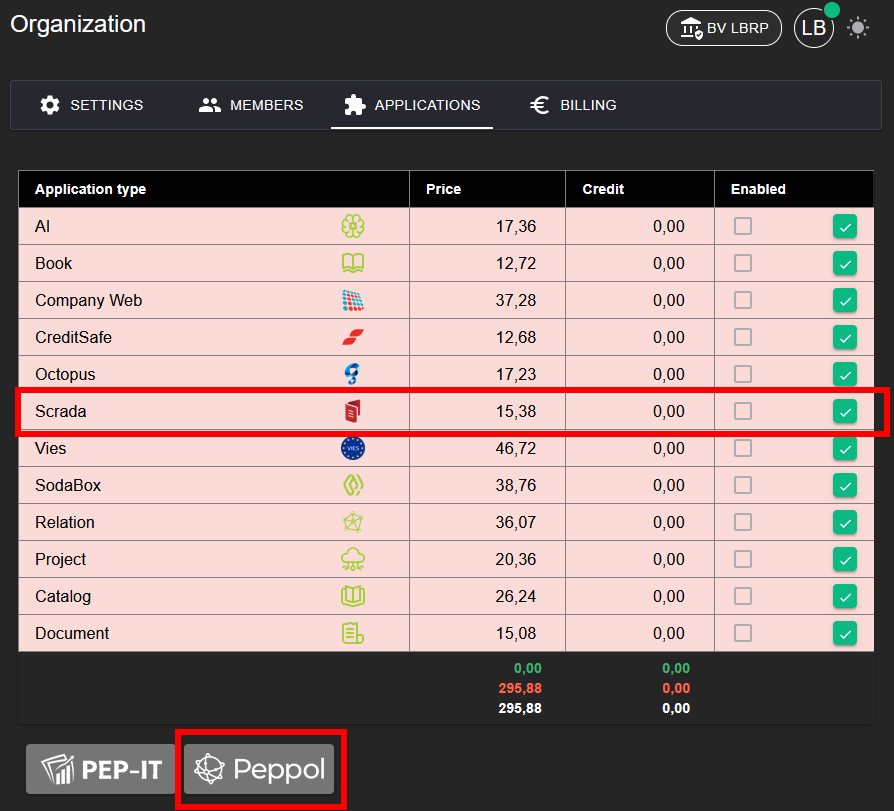
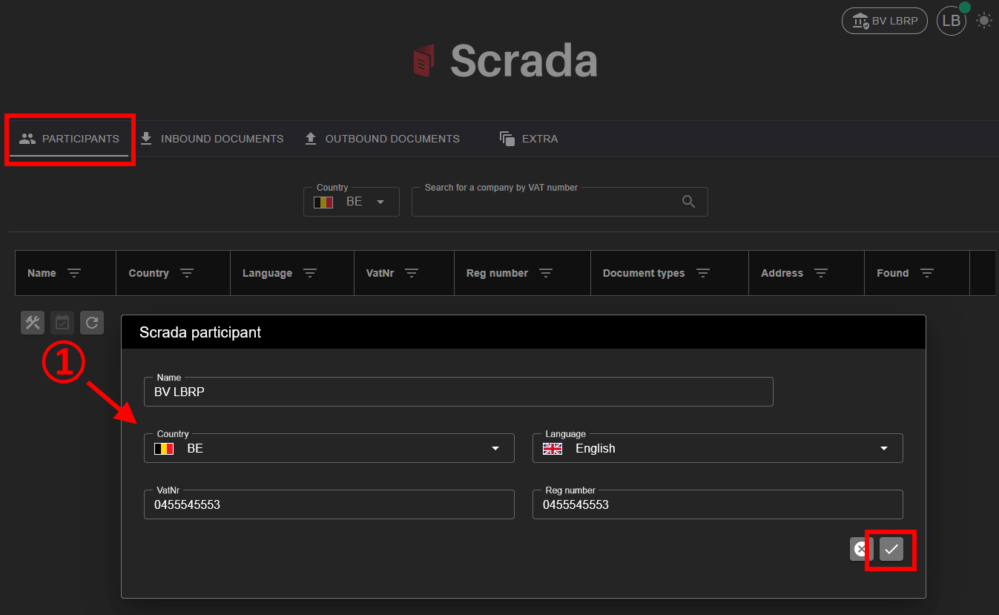

# Scrada

## 1. Applicatie Activeren

Om de **Scrada** applicatie te kunnen gebruiken, moet deze eerst geactiveerd worden.

**Stappen:**
1. Ga naar **Organization → [Applications](../Identity/Applications/README.md)**.
2. Activeer de applicatie **Scrada** voor uw organisatie.
3. Na activatie is de Peppol-functionaliteit beschikbaar in het menu.

## 1. Participants

## 1.1. Zoeken op BTW nummer

## 1.2. Eigen Organisatie registreren

## 2. Inbound

## 3. Outbound

## 4. Extra

## 4.1. Verstuurde E-mails

## 4.2. Inbound via SFTP (3th-Party)

## 4.3. Convert (UBL <-> PDF)

