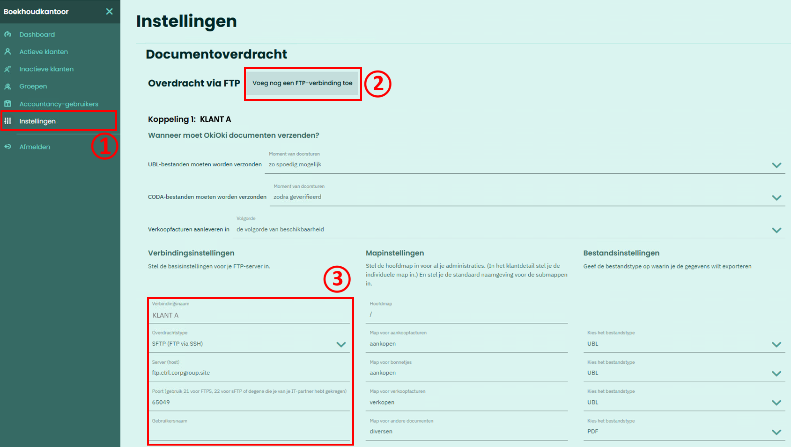
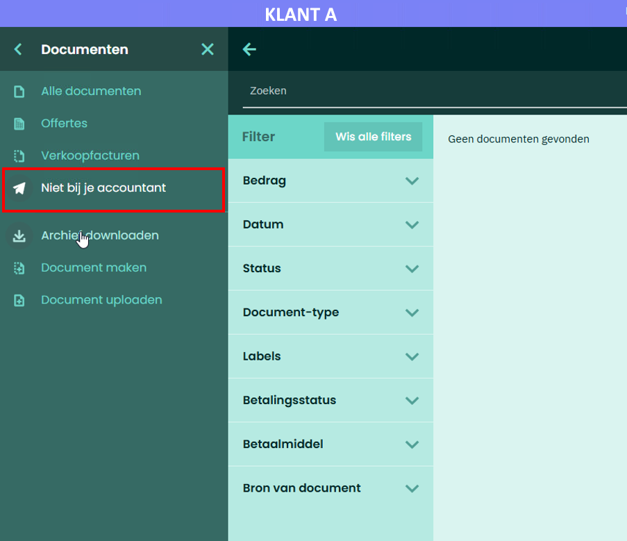

# SFTP Integration - Oki Oki

## 1. FTP-Integratie instellen

In **Oki Oki** moeten er eerst FTP-verbindingen worden aangemaakt die u daarna (_punt 2_) kunt selecteren per **Bedrijf**

1. Ga naar de **Algemene Instellingen** van uw boekhoudkantoor.
2. Klik **Voeg FTP-verbinding toe**. 

   - Indien u een algemene verbinding (_voor alle bedrijven_) wil gebruiken, vult u hier een naam in naar keuze.
   - Indien u een verbinding voor een specifiek bedrijf wil gebruiken vult u hier best de naam (_of BTW-nummer_) van dat berdrijft in.

3. Vul de **Credentials** in tijdens het aanmaken van het SFTP-account in **AccoWin** (_zie [SFTP Integration](../README.md)_)

   

## 2. FTP-Integratie koppelen aan een Dossier

1. Ga naar de **Instellingen** van een Dossier
2. Selecteer de eerder gemaakte **FTP-Integratie**

   

   💡 **LET OP**: Vul in het vak "**_sFTP-mapnaam voor Bedrijf_**" het BTW-nummer van het bedrijf in dat als root-folder op de SFTP-server voor dit bedrijf zal worden gebruikt. De subfolders voor **Verkopen**, **Aankopen**, **CODA**, etc... worden hier onder aangemaakt.

## 3. Verzenden van Documenten naar SFTP-server

1. Ga naar het bedrijf waarvan u de documenten wilt versturen.
2. Klik op **Documenten**

   

3. Klik op "Niet bij je accountant"

   

4. Rechtsboven vind een knop om de Documenten te versturen naar de SFTP-server.

   💡 **LET OP**: De verzonden documenten worden opgevangen en na een tijd (om het uur) in onze database gestoken. Pas daarna kunt u ze in AccoWin binnen halen
