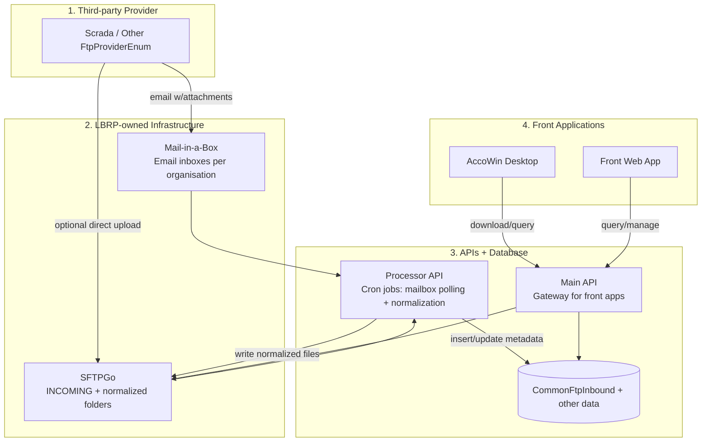
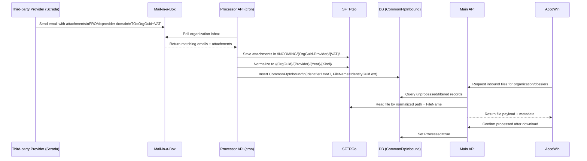

# Draft Prompt used for Result

Can you create a MD file with some explaination and a mermaid diagram to visualize the building block used to explain the flow to transfer files from a 3th-Party cloud application, called Scrada,
(or any other application as defined in LBRP.Services/LBRP.Services.ABF/src/LBRP.Services.ABFShared/Enums/Common/FtpProvider.cs) to the final destination,
a Windows Desktop Legacy application called AccoWin.

From top to bottom we have the following parts per abstracted level:
- 1: 3th party provider Scrada
- 2: Our Own:
     - E-mail Server (Mail-in-a-Box)
     - SFTP Server (SFTPGo)
- 3: Our API's and the Database
     - Main API as a layer between other API's, the Front web application and the databases.
     - Processor API to perform work on a cronjob sush as:
	   - Monitoring Inboxes on the E-mail Server of various Accounts created per Organisation.
         Certain E-mails contain files that will be transfered to the SFTP /INCOMING folder.
		 The FROM-adres will contain the domain of the 3th-part provider
		 The TO-adres contains the destination Organisation-Guid + a VAT-number representing a Customer of the Organisation that needs to retrieve files from whatever 3th-party application this Customer is using.
		 The Attachments will be stored in a subfolder of /INCOMING with a name concisting out of The destination Organisation-Guid, a -, and the provider name. This way we can identify the destination Organisation and know what the 3th-Party structure of the various files and folders will be.
		 In this folder there will be another subfolder that has the VAT-number of the cuistomer as name.
		 Subfolders and files in this 2nd subdolder are provider specific.	 
	   - Monitoring a temporary SFTP folder /INCOMING for new files in order to move them to a correct folder deticated for each registered Organisation and normalize the folder structure to our own specs.
	     The root folder will be named as an Organisation Guid only.
		 The 2nd level folder will be the name of the provider
		 The 3th will be the Year (current year of time of synchronization mostly)
		 The 4th will be the file type (see LBRP.Services/LBRP.Services.ABF/src/LBRP.Services.ABFShared/Enums/Common/FtpFileKind.cs) and will be determined mainly by file extention, but also its content for certain file types (XML, UBL)
		 In this folder all source files will be stored after a database record was created (see LBRP.Services/LBRP.Services.ABF/src/LBRP.Services.ABFShared/Models/Common/CommonFtpInbound.cs for the table Model)
		 The filename will be changed to the Identity field (also a Guid) and the original file extention.
		 The Meta data in the table goes into the various (1-5) Identifier fields.
		 At the moment only Identifier1 will contain the VAT-number of the Customer.
- 4: Front Applications talking via the Main API
    - Front Web Application. Not much details are needed at the moment
	- AccoWin:
	  In this Windows Desktop Application we have implemented as much as possible functionality to abstract away as much as possible of what happens in the cloud. Our users are not used to working with cloud applications for the moment.
	  Things that can be done directly in AccoWin in order to configure all needed blocks are the following and as good as in this order:
	  - Register your Organisation in the cloud by providing a username, password and VAT-number of your company.
	    A User and Organisation will be created, and this User will automatically become a Member of his own Organisation.
	  - Request an E-mail account for this Organisation to which Customers can sent their files. The creation of the account in the Mail-in-a-Box application is automated via the Main API and credentials will be stored for this organisation.
	  - Each Customer is represented by their own Dossier/Company in AccoWin and has a VAT Number. A complete e-mail address is displayed in AccoWin when opening a Dossier and contains the Main Organisation Guid and the VAT number of the Dossier.
	    This address can be shared with that Customer and configured in the 3th party application to send files by e-mail.
	  - When Incoming files have been added to the database of the organisation and copied to the correct SFTP folder it is possible to directly download these files in AccoWin to a local folder.
	    When downloaded a file the Processed field in CommonFtpInbound will be set to True.
		Files will be downloaded in the Dossier of the Main Organisation (most of the time, but it depends on the use-case and setup), but will be placed in the correct folders of the Dossier of a Customer because of the identifier1 field which includes the VAT number of the customer

This concludes the flow starting from e-mail.

It is perfectly possible to skip the e-mail and create a SFTP user for each dossier with an own subfolder in the /INCOMING
This SFTP user will be named the same as stated before. The disatvantage is that most of the time a seperate SFTP user needs to be created per Dossier in Accowin because they may not access other companies files.
Therefore each Dossier needs to be created in the cloud first as its own Organisation. This can be done by pressing an Invite button in a Dossier in Accowin.
For Main Organisations that have control of the 3th-party providers integration settings, this is possible because passwords are hidden once provided.
For Main Organisation that need to sent SFTP credentials by email to their Customers this is not recommended and could be a security risk.
If a Main Organisation is an Accountant with many Customers E-mail is the preferred method.
If a Main Organisation is a Self-Employed person managing their own Accounting SFTP is possible.
It depends on the usage of AccoWin the structure etc... wich is better.
Email is easier to setup most of the time.
Some providers don't automatically sync via e-mail but do so via SFTP. So that can be a disatvantage.


# File Transfer Flow — Scrada (and other providers) to AccoWin

This document explains the building blocks and end-to-end flow used to transfer files from a third-party cloud provider (such as **Scrada**, or any provider in `FtpProviderEnum`) to the final destination in **AccoWin**.

## Scope and Invariants

- **Source providers** are represented by `FtpProviderEnum` (e.g., Scrada, CodaBox, Billit, ...).
- **Inbound records** are persisted in `CommonFtpInbound`.
- **Current business identifier mapping** uses `Identifier1 = Customer VAT number`.
- **AccoWin download completion** sets `Processed = true`.

Code anchors:

```csharp

public enum FtpProviderEnum
{
    CodaBox = 1,
    Billit = 2,
    BillToBox = 4,
    Doccle = 8,
    Clearfact = 16,
    Yuki = 32,
    Qweon = 64,
    OkiOki = 128,
    Blox = 256,
    CoManage = 512,
    Breex = 1024,
    Optedo = 2048,
    Odoo = 4096,
    TeamLeader = 8192,
    MyFact = 16384,
    Salieri = 32768,
    ZenFactuur = 65536,
    EenvoudigFactureren = 131072,
    Dexxter = 262144,
    Onfact = 524288,
    Scrada = 1048576,
}

public enum FtpFileKindEnum
{
    None = 0,
    UblSale = 1,
    UblPurchase = 2,
    Coda = 4,
}
```

```csharp
public class CommonFtpInbound : BaseAuditableEntity
{
    public FtpProviderEnum Provider { get; set; }
    public int Year { get; set; }
    public FtpFileKindEnum Kind { get; set; }
    public FileExtEnum Format { get; set; }
    public string Identifier1 { get; set; } // VAT
    public string Identifier2 { get; set; }
    public string Identifier3 { get; set; }
    public string Identifier4 { get; set; }
    public string Identifier5 { get; set; }
    public string FileName { get; set; }    // GUID + original extension
    public DateTimeOffset FileCreated { get; set; }
    public bool Processed { get; set; }
}
```

## Building Blocks by Abstraction Level

1. **Third-party provider layer**
   - Scrada (reference provider)
   - Any other provider supported by `FtpProviderEnum`

2. **LBRP-owned transfer infrastructure**
   - **Mail-in-a-Box** (email intake)
   - **SFTPGo** (staging + normalized storage)

3. **LBRP APIs + database**
   - **Main API**: orchestration boundary for front apps and underlying APIs/data
   - **Processor API** (cron-driven work):
     - Poll inbound mailboxes
     - Extract attachments
     - Stage files into SFTP `/INCOMING`
     - Normalize folder structure
     - Detect file kind
     - Persist `CommonFtpInbound`

4. **Front applications via Main API**
   - Front Web Application (out of scope details)
   - **AccoWin** desktop app, hiding cloud complexity for end users

## Primary Flow (Email-based, Preferred)

### 1) Provider sends email with attachments

- **FROM** address domain identifies provider domain context.
- **TO** address encodes:
  - main destination Organisation GUID
  - customer VAT number

### 2) Processor API mailbox monitoring

- Processor checks organization-specific inboxes.
- Attachments are stored in SFTP staging path:

`/INCOMING/{OrganisationGuid}-{Provider}/{CustomerVat}/...provider-specific subfolders/files...`

### 3) Processor API SFTP staging normalization

- Processor monitors `/INCOMING` and moves files to normalized structure:

`/{OrganisationGuid}/{Provider}/{Year}/{FtpFileKind}/`

- `FtpFileKind` is derived primarily by extension and, for certain files, by content inspection (XML/UBL distinction).
- A `CommonFtpInbound` row is created.
- Stored filename is rewritten to:

`{CommonFtpInbound.IdentityGuid}.{originalExtension}`

- Metadata mapping:
  - `Provider`, `Year`, `Kind`, `Format` populated from classification
  - `Identifier1 = Customer VAT`
  - `Identifier2..5` reserved for additional context

### 4) AccoWin retrieval

- AccoWin calls Main API to list and download inbound files.
- On successful download:
  - `CommonFtpInbound.Processed = true`
- Files are physically downloaded in the main organization context, but dossier routing is done using `Identifier1` (customer VAT) so each customer dossier receives correct files.

## Alternative Flow (Direct SFTP Ingestion)

It is possible to skip email and provision direct SFTP ingestion into `/INCOMING`.

### How it works

- Create SFTP user/subfolder scheme consistent with organization + dossier segregation.
- In many real setups, this implies one SFTP user per dossier/company to avoid cross-access.
- Dossiers often need cloud registration first (AccoWin Invite flow).

### Trade-offs

- **Pros**
  - Works for providers that support SFTP better than email
  - Good for single-entity/self-employed setups
- **Cons**
  - Credential distribution overhead
  - Potential security risk when credentials must be emailed/shared externally
  - Less ergonomic for accountants with many customers

**Practical guidance**:
- Accountant with many customers → prefer **email**.
- Self-employed/single-account context → **SFTP** can be practical.
- Provider capabilities can force one method over the other.

## Architecture Diagram (Layered)



## Sequence Diagram (Email Path)



## Folder Contract

- **Staging**:
  - `/INCOMING/{OrganisationGuid}-{Provider}/{CustomerVat}/...`
- **Normalized target**:
  - `/{OrganisationGuid}/{Provider}/{Year}/{FtpFileKind}/{IdentityGuid.ext}`

## Related Lodes

- [ABF file transfer domain summary](./summary.md)
- [Patterns and practices](../practices.md)
- [Terminology](../terminology.md)
