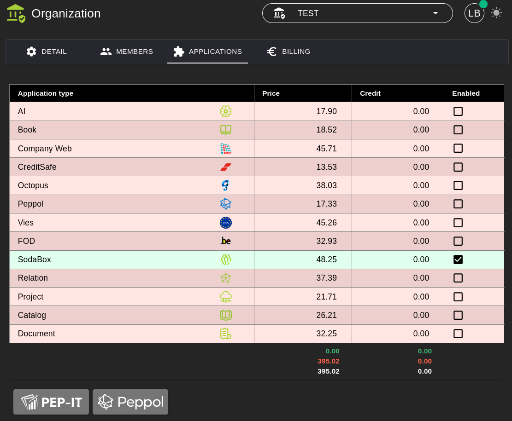
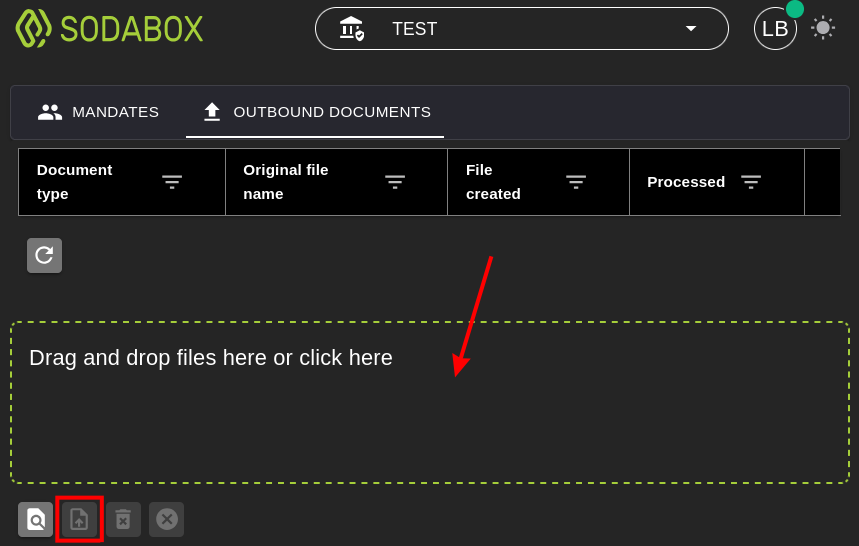

# SodaBox

## 1. Applicatie Activeren

Om de **SodaBox** applicatie te kunnen gebruiken, moet deze eerst geactiveerd worden.

**Stappen:**
1. Ga naar **Organization → [Applications](../Identity/Applications/README.md)**.
2. Activeer de applicatie **SodaBox** voor uw organisatie.
3. Na activatie is de SodaBox-functionaliteit beschikbaar in het menu.

## 2. SodaBox

Met de **SodaBox** applicatie kunt u loonboekingen in het **SODA-formaat*** naar [**CodaBox**](https://codabox.com/producten/soda/) of [**Coda Clean**](https://www.codaclean.io/) verzenden om ze voor allerlei boekhoudsoftware ter beschikking te stellen.

**Het SODA-formaat is een gestandaardiseerd elektronisch formaat dat loonboekingen van sociale secretariaten (Belcofin) automatisch digitaal aflevert in jouw boekhoudsoftware (AccoWin).*

### 2.1 Mandaten

Als boekhouder kunt u enkel loonboekingen in naam van uw klanten versturen als u hiervoor een **Mandaat** hebt aangevraag bij ofwel **CodaBox** ofwel **CodaClean**. Verder moeten de volgende voorwaarden in orde zijn:

1) De klant moet als **gebruiker** en **organisatie** in ons systeem gekend zijn en een **account** hebben. 
Dit is **kostloos** zolang de klant geen andere applicaties activeerd. 
*Onze software gebruiken is helemaal niet nodig, maar er moet wel een account en organisatie bestaan.*

2) Het **Mandaat** moet vervolgens voor de betreffende **organisatie** in onze **SodaBox** applicatie geactiveerd worden. 
*Dit kan enkel door LBRP geregeld worden.*

### 2.2 Verzenden

Op het tabblad **Outbound** kunt u **XML-bestanden** in het **SODA-formaat** verzenden.

## 3. Belcofin

De **SodaBox** applicatie is volledig geintegreerd in onze **BelcoFin** Desktop Applicatie waardoor bovenstaande handelingen geautomatiseerd werden.

Lees het stuk [SodaBox](../../../Desktop/UserManuals/BelcoFin/SodaBox/README.md) in het gedeelte van deze handleiding over onze [Desktop Applicaties](../../../Desktop/UserManuals/README.md)