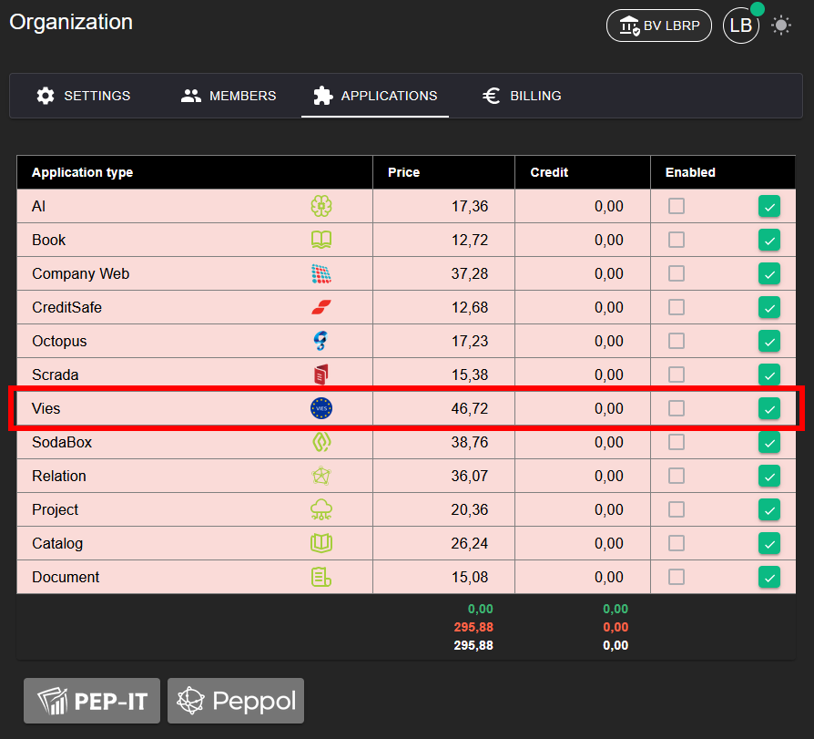
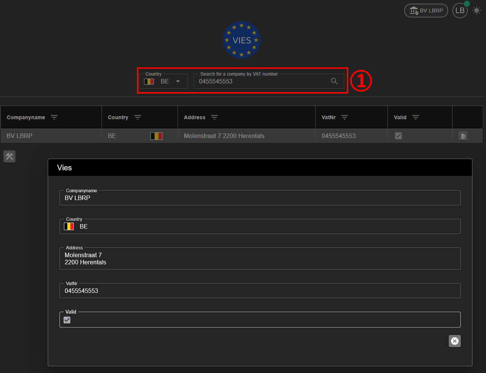

# Vies

## 1. Applicatie Activeren

Om de **VIES** applicatie te kunnen gebruiken, moet deze eerst geactiveerd worden.

**Stappen:**
1. Ga naar **Organization → [Applications](../Identity/Applications/README.md)**.
2. Activeer de applicatie **Vies** voor uw organisatie.
3. Na activatie is de Vies-functionaliteit beschikbaar in het menu.

## 2. Zoeken

Met de Vies applicatie kan u bedrijven opzoeken op basis van hun **BTW-nummer (VAT number)**.

**Stappen:**
1. Open de **Vies** applicatie.
2. Geef het BTW-nummer in (inclusief landcode).
3. Start de zoekopdracht 🔍

**Resultaat:**
- Indien het bedrijf wordt gevonden, worden volgende gegevens automatisch opgehaald:
  - Naam
  - Land
  - Adres
- De status **Valid** geeft aan dat het BTW-nummer geldig is.
- De status **Invalid** geeft aan dat het BTW-nummer niet werd gevonden of ongeldig is.

## 3. Integratie

De Vies-functionaliteit is geïntegreerd in andere applicaties. Hierdoor kunnen bedrijfsgegevens automatisch worden opgehaald op basis van het BTW-nummer.

**Voorbeelden van integratie:**
- Bij het aanmaken of bewerken van een **Relatie** kunnen naam, land en adres automatisch worden ingevuld via Vies.
- Binnen **Organisaties** kan het BTW-nummer gevalideerd worden en worden de bijhorende gegevens opgehaald.

Raadpleeg de volgende handleidingen voor meer informatie:
- [Relation](../Relation/README.md)
- [Organization](../Identity/Organizations/README.md) -> Organisatiegegevens invullen
