# Hoe de UBL- bestanden importeren?

> **Let op:** dit is de oudere handleiding voor het scherm <ins>Inlezen UBL</ins> (`ImportUblForm`). De actuele beschrijving vindt u in [Inlezen UBL bestanden](../Import/README.md) en [Instellingen UBL](../Settings/README.md). Terug naar het [UBL-overzicht](../README.md).

Accowin voor het inlezen van UBL te installeren.

Via menu: UBL import - instellingen UBL

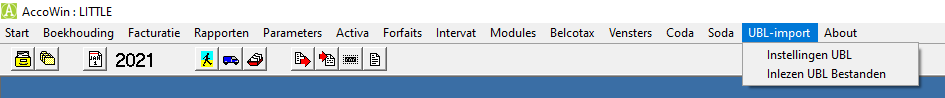

U kan dan de parameters voor het verwerken van de UBL bestanden instellen via het menu “UB-import” – Instellingen UBL.
Billit gaat een map voorzien waarin uw aankoopfacturen in UBL formaat (en eventueel verkoopfacturen) worden geplaatst.

Deze mappen moet u opgeven op de verschillende tabbladen van de instellingen:

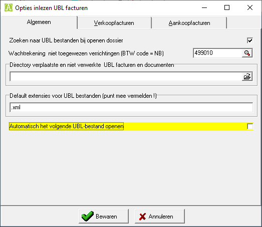

De mappenstructuur kan u best als volgt opbouwen:

(Vergelijkbaar met de verwerking van CODA bestanden)

Een map voor elk dossier (0123456789)
Daaronder een map voor de aankopen en een map voor de verkopen
Onder deze mappen een submap voor de verwerkte facturen en eventueel voor facturen die u later wenst te verwerken omdat ze moeten worden nagekeken of reeds voor een volgende boekingsperiode zijn.

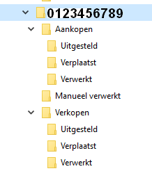

Er wordt ook een map voorzien voor UBL facturen die u manueel zou verwerken.

Voor de verkopen dient u op te geven op welke grootboekrekeningen  en in welk dagboek standaard wordt geboekt, maar ik heb begrepen dat u de verkoopfacturen opleest via de XML van Accowin.

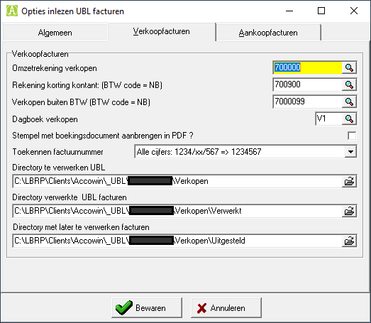

Voor de aankopen geeft u het standaard dagboek, de standaard aankooprekening  en de rekeningen voor toepassing van korting kontant of aankopen vrijgesteld van BTW.
Geef ook de standaard BTW codes in voor aankopen medecontractant of intracom.

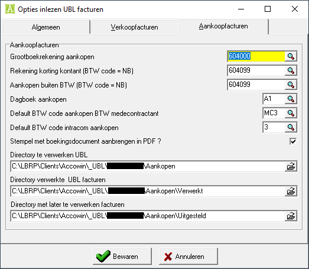

Als u het vinkje aanzet bij “Stempel met boekingsdocument aanbrengen in PDF”, zal in de PDF van de factuur een stempel worden gezet met de verwijzing naar het dagboek en documentnummer van de boeking van de factuur.

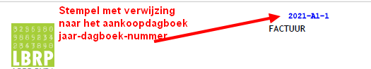

U kan de UBL facturen op 2 manieren verwerken:

1) Via het globaal scherm waar alle UBL facturen worden getoond die in de mappen van de aankopen en verkopen klaar staan:

Hier wordt per document een voorstel van boeking getoond.
Klanten / Leveranciers die niet bestaan, kunnen worden aangemaakt door op  te klikken.

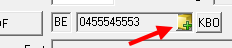

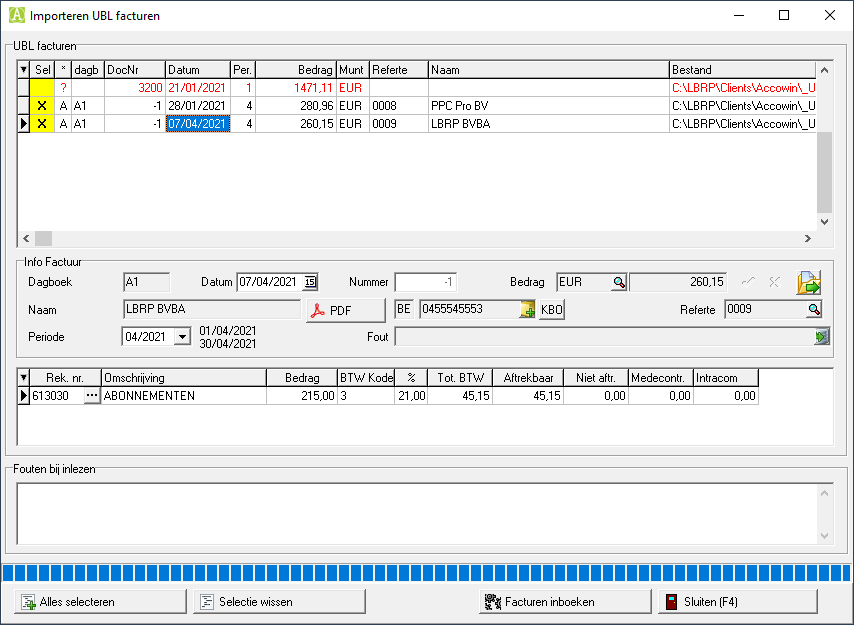

Selecteer de facturen die u wenst in te boeken.

Deze worden dan naar het scherm voor het inboeken van de aankopen en verkopen gezonden om te worden ingeboekt.

(Deze methode wordt vooral gebruikt voor verkoopfacturen)

2) Via het scherm voor het inboeken van de aankopen of verkopen:

Selecteer het factuurnummer en druk op F2 of klik op de knop “UBL importeren (F2)”

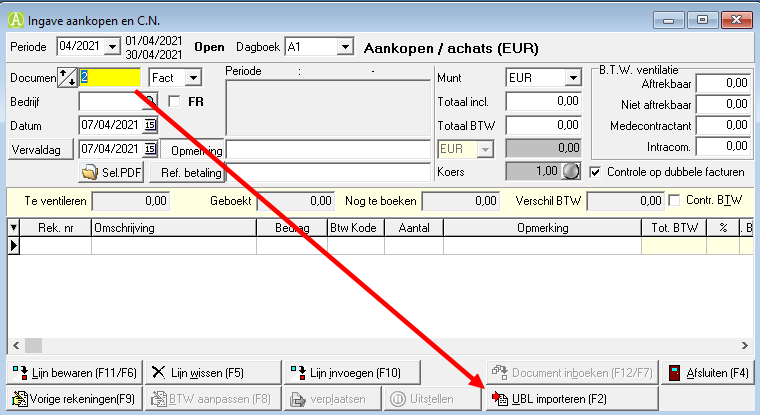

Zie dan de lijst met UBL bestanden.

Selecteer een bestand om in te lezen. De gegevens worden opgehaald en ingevuld in het scherm.

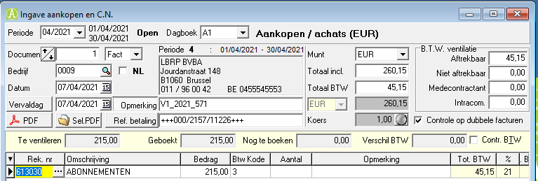

In het afzonderlijk scherm wordt de PDF uit de UBL getoond. (Indien de PDF niet getoond word of u op de PDF wenst in te zoomen, kan u klikken op de knop

Indien de leverancier gekend is en op de leveranciersfiche werd een standaard boekingsrekening ingevuld, zal die grootboekrekening worden voorgesteld als boeking.

Als de boekingen kloppen, kan u de factuur goedkeuren via F12. (of de knop “Document inboeken”)

Na het inboeken van de factuur, wordt deze verplaatst naar de door u opgegeven map voor verwerkte facturen.

Omdat de PDF van de factuur beschikbaar is, kan u in de historiek bij de leveranciers (of klanten) de PDF oproepen.

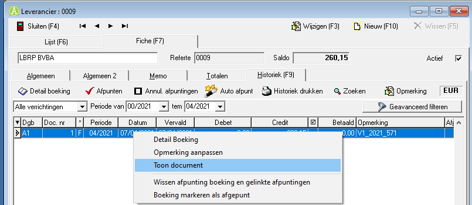

Klik met de rechter muisknop op de lijn van de boeking in de historiek en selecteer “Toon document”

De PDF zal worden getoond.

Documenten die niet of later moeten worden verwerkt kunnen worden verplaatst naar een afzonderlijke map

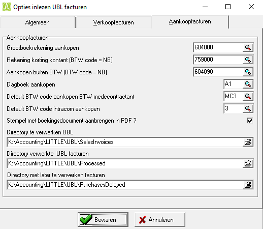

Opties Verkoopfacturen

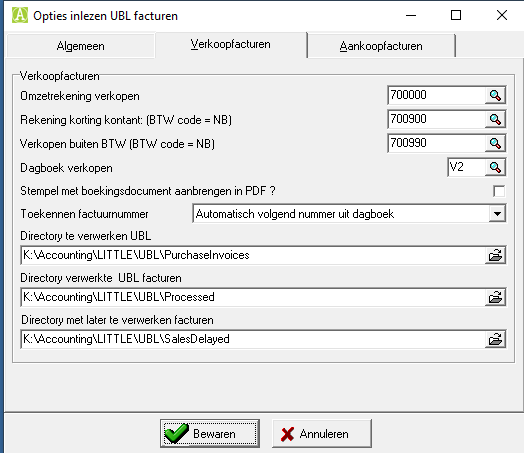

Opties Aankoopfacturen

Importeren van UBL facturen

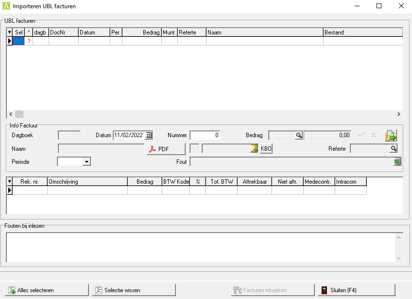

Datum en factuurnummer (enkel voor verkopen) kan worden aangepast.

Het factuurnummer voor verkopen wordt nu anders herkend zodat er minder risico is dat voor alle verkopen hetzelfde nummer wordt gegenereerd

01/2018 => 12018 en 02/208 => 22018 en niet meer 2018 voor beide facturen

Het scherm van de PDF kan beter worden geselecteerd.

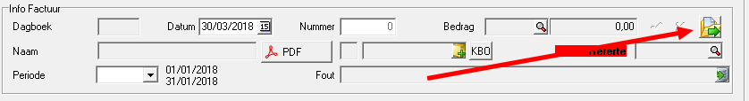

