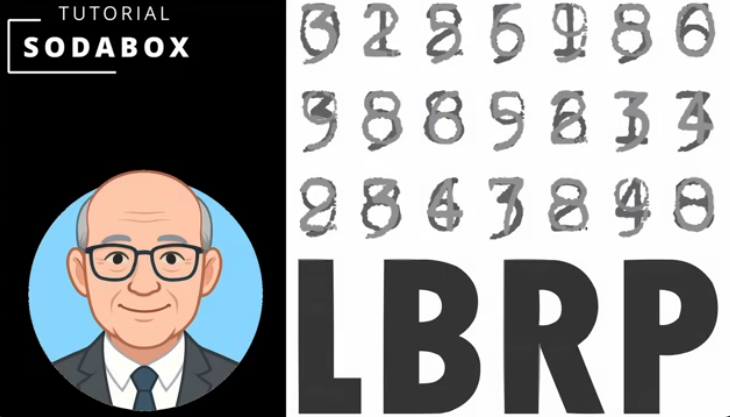
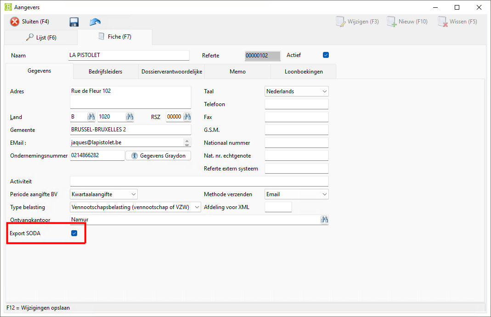
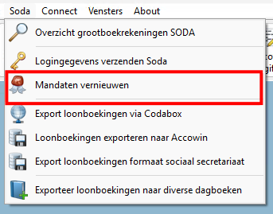
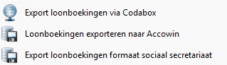
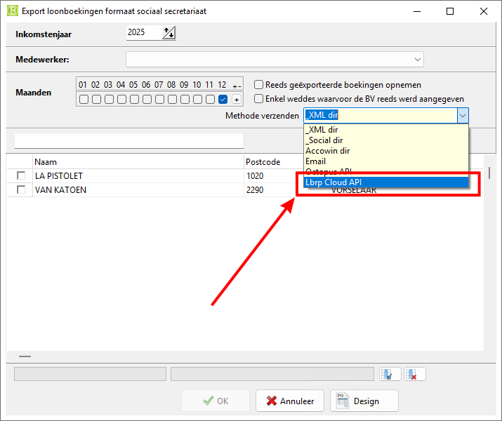

# Desktop - BelcoFin - SodaBox

## 1. Inleiding

Met de **SodaBox**-applicatie kunt u loonboekingen in het **SODA-formaat** naar [**CodaBox**](https://codabox.com/producten/soda/) of [**CodaClean**](https://www.codaclean.io/) verzenden vanuit **BelcoFin**.

U hebt hiervoor een connectie met ons online platform nodig. 
Bekijk het volgende filmpje om deze connectie te configureren:

- **YouTube Tutorial** (*niet meer up-to-date, lees **LET OP** verderop*)

   

- **Zie ook** ➡️ [Cloud Connectie vanuit BelcoFin](../Cloud/README.md)

### 1.1 Mandaten activeren

Als boekhouder kunt u enkel loonboekingen in naam van uw klanten versturen wanneer u hiervoor een **mandaat** hebt aangevraagd bij **CodaBox** of **CodaClean**. Daarnaast moeten de volgende voorwaarden in orde zijn:

#### 1.1.1 Account van uw klant (*Aangevers/Bedrijfsleiders*) op ons Cloud Platform

De klant moet als **gebruiker** en **organisatie** in ons online platform gekend zijn en een **account** hebben.  
Dit kan volledig vanuit **BelcoFin** geconfigureerd worden.

**LET OP ❗❗❗** 
*In het bovenstaande filmpje ontbreekt een stap om een aangever te registreren in de cloud.*  
*Vooraleer de aangever gesynchroniseerd kan worden, moet het vinkje **Export SODA** worden aangezet.*

#### 1.1.2 SodaBox voor het account van uw klant activeren

Het verkregen **mandaat** moet door ons (LBRP) voor de betreffende **organisatie** in onze **SodaBox**-applicatie worden geactiveerd. 
*Dit kan enkel door LBRP geregeld worden.*

### 1.2 Mandaten in BelcoFin actualiseren

Nadat de **SodaBox**-activatie voor uw klant door ons in orde werd gebracht, kunt u in **BelcoFin** de huidige situatie voor alle aangevers synchroniseren met ons Cloud Platform via het menu **Soda** ➡️ **Mandaten vernieuwen**.

**SUPPORT** 
*Geef ons gerust een seintje als er **SodaBox**-activaties ontbreken.*  
*De migratie naar ons nieuwe Cloud Platform was dringend en complex, en de automatisering van deze **flow** is nog niet volledig geoptimaliseerd.*

## 2. Soda-bestanden verzenden

Via het menu **Soda** kunt u Soda-bestanden versturen naar **CodaBox** of **CodaClean**:

- **CodaBox**: Exporteert loonboekingen via ***CodaBox***  
- **CodaClean**: Exporteert loonboekingen in het formaat van het ***Sociaal Secretariaat***

## 3. Cloud Platform

De **SodaBox**-applicatie kan ook gebruikt en geraadpleegd worden via ons **Cloud Platform**.

Lees het onderdeel [SodaBox](../../../../Cloud/UserManuals/SodaBox/README.md) in de handleiding over ons [Cloud Platform](../../../../Cloud/UserManuals/README.md).