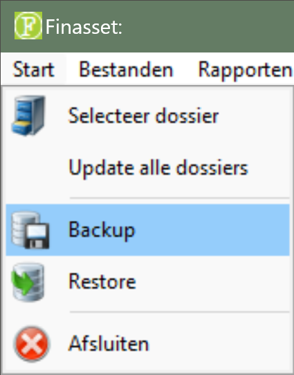
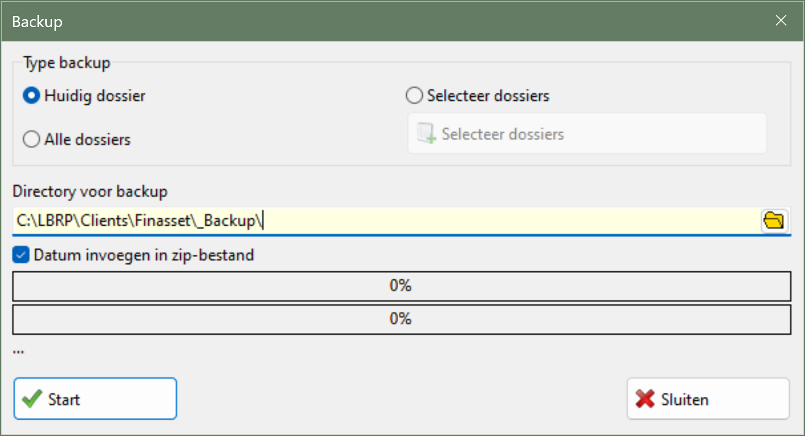
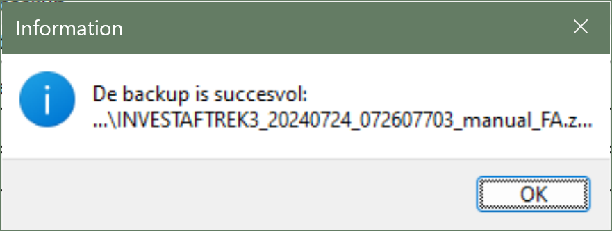
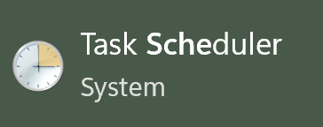
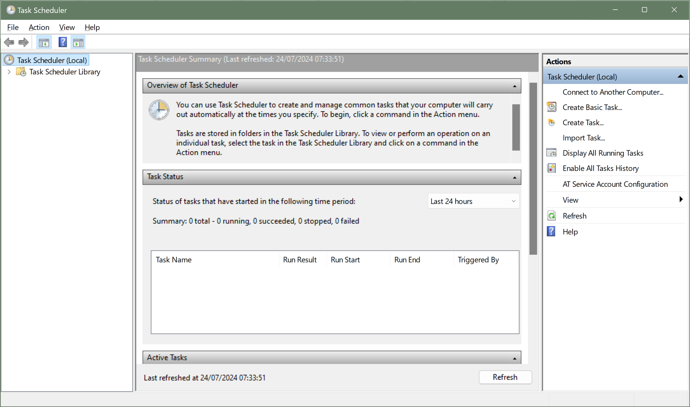
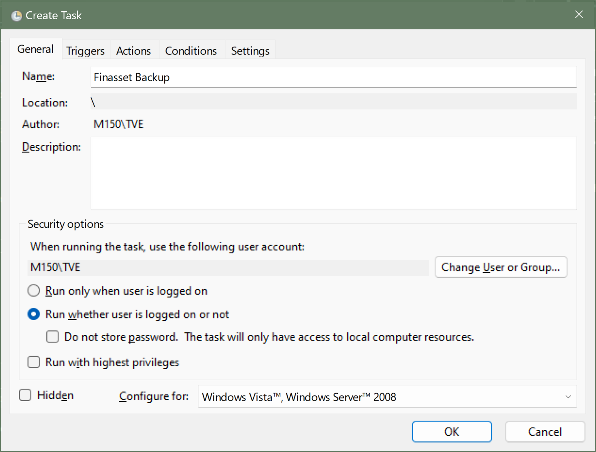
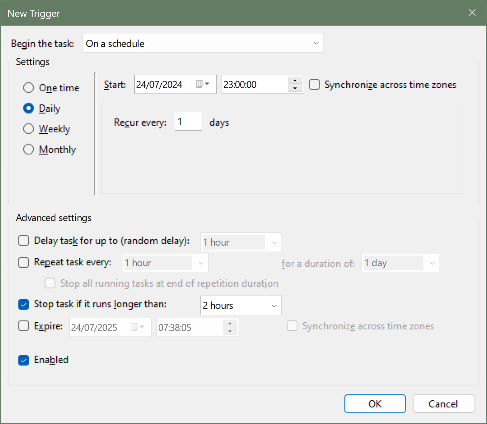
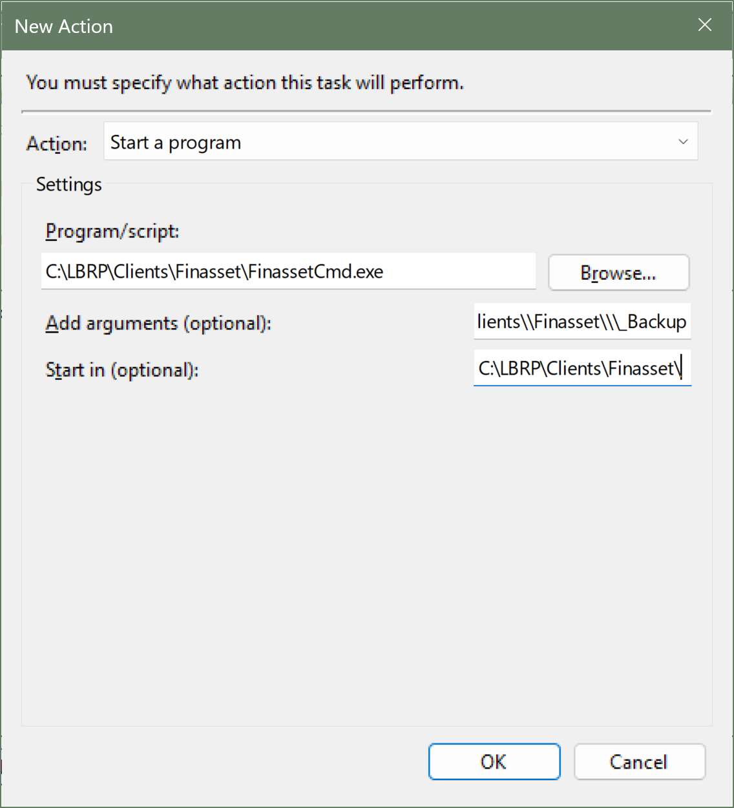

# Desktop - Finasset - Backup Database

## 1. Inleiding

Er zijn drie manieren om back-ups van Finasset te maken:

- Handmatig via de grafische gebruikersinterface

- Handmatig via opdrachtregelparameters

- Automatische back-up via de Taakplanner

Het wordt aanbevolen om te kiezen voor automatische back-up zodat uw gegevens van Finasset altijd worden geback-upt.

## 2. Handmatig Back-up via Grafische Gebruikersinterface

Volg de onderstaande stappen om handmatig een back-up te maken via de grafische gebruikersinterface:

1. **Start** Finasset.

2. Menu ▶️ Start ▶️ **Backup**.

   

3. Selecteer de **locatie** waar de back-up moet worden opgeslagen.

4. Als u de optie **Datum invoegen in zip-bestand** aanvinkt, wordt de huidige datum en tijd toegevoegd aan de bestandsnaam van de back-up. Anders wordt de naam van de back-up de naam van de Finasset-database, wat meestal 'Finasset' is.

   

5. Klik op **Start**
6. De melding Back-up gemaakt onderaan het scherm wordt getoond als alles goed is verlopen

   

## 3. Handmatig Back-up via Opdrachtregelparameters

Gebruik `FinassetCmd.exe`, dat u in de Finasset Client-directory kunt vinden, om back-ups te maken met behulp van opdrachtregelparameters.

Mogelijke command line parameters zijn:

<table>
  <thead>
    <tr>
      <th>Naam</th>
      <th>Omschrijving</th>
      <th>Verplicht</th>
    </tr>
  </thead>
  <tbody>
    <tr>
      <td>/host:&lt;host naam&gt;</td>
      <td>De naam van de Finasset server</td>
      <td>✅1️⃣</td>
    </tr>
    <tr>
      <td>/ipaddress:&lt;ip adres&gt;</td>
      <td>IP adres van de Finasset server.</td>
      <td>✅1️⃣</td>
    </tr>
    <tr>
      <td>/port:&lt;poort nummer&gt;</td>
      <td>Poort van de server. Als niet meegegeven dan wordt de<br> standaard poort nummer gebruikt.</td>
      <td></td>
    </tr>
    <tr>
      <td>/db:&lt;database naam&gt;</td>
      <td>Naam van de database. Als niet meegegeven dan wordt<br> de standaard database van Finasset gebruikt.</td>
      <td></td>
    </tr>
    <tr>
      <td>/language:&lt;taal&gt;</td>
      <td>De taal van de foutmeldingen:
        <ul>
          <li>N: Nederlands</li>
          <li>F: Frans</li>
        </ul>
      </td>
      <td></td>
    </tr>
    <tr>
      <td>/BackupPath:&lt;pad&gt;</td>
      <td>Het pad waar de backup wordt bewaard</td>
      <td>✅</td>
    </tr>
    <tr>
      <td>/BackupIncludeDate</td>
      <td>Als deze parameter gebruikt wordt dan wordt de huidige<br> datum en tijd toegevoegd aan de naam van het backup<br> bestand.</td>
      <td></td>
    </tr>
    <tr>
      <td>/logfile: &lt;bestandsnaam&gt;</td>
      <td>De locatie en naam van het bestand waar de logging<br> informatie van de backup in staat. Als deze parameter<br> niet gebruikt wordt dan wordt geen log bestand<br> aangemaakt.</td>
      <td></td>
    </tr>
    <tr>
      <td>/loginfo</td>
      <td>Als deze parameter wordt toegevoegd dan wordt naast<br> de fouten ook extra logging informatie getoond en/of<br> weggeschreven in het log bestand.</td>
      <td></td>
    </tr>
    <tr>
      <td>/overwritelog</td>
      <td>Als deze parameter gebruikt wordt dan wordt log<br> bestand overschreven telkens het programma wordt<br> uitgevoerd. Als de parameter niet wordt gebruikt dan<br> wordt de logging steeds toegevoegd aan bestaande<br> logbestand.</td>
      <td></td>
    </tr>
  </tbody>
</table>

1️⃣ *Ofwel de naam van de server ofwel het IP-adres is verplicht. Als beide worden opgegeven, wordt de hostnaam gebruikt.*

<strong><ins>Voorbeeld</ins></strong>:

```
FinassetCmd.exe /host:localhost /db:Finasset /BackupXml /BackupPdf /BackupPath:C:\\LBRP\\Clients\\Finasset\\\_Backup
```

## 4. Automatische Back-up via Taakplanner

### 4.1 Inleiding

**Belangrijke opmerkingen** voordat u begint met het configureren van de automatische back-up:

1. De automatische back-up wordt bij voorkeur op de server geconfigureerd en niet op een werkstation.
2. De Finasset Client moet op de server geïnstalleerd zijn.
3. Als u de back-up instelt op een tijdstip waarop de computer niet draait, worden er geen back-ups gemaakt. Daarom is het aan te raden om automatische back-ups op een server in te stellen, omdat deze meestal nooit worden uitgeschakeld.

### 4.1 Taakplanner





1. Klik **Maak Taak** en geef uw taak een naam

   

2. Maak een **Trigger** aan (*bijvoorbeeld elke dag*).

   

3. Maak een **Action** aan en kies `FinassetCmd.exe` met de nodige parameters.

   

   Een voorbeeld van de waarde van Uitvoeren kan zijn: 
   ```bash
   C:\\LBRP\\Clients\\Finasset\\FinassetCmd.exe /host:localhost /db:Finasset /BackupPath:C:\\LBRP\\Clients\\Finasset\\\_Backup
   ```   

4. Klik op **OK**

## 5. Restore backup

Een back-up kan als volgt worden teruggezet:

1. Finasset opstarten

2. Ga naar Menu ▶️ **Start** ▶️ **Restore**.

3. Selecteer het back-up bestand.

4. Klik op de knop **Start Restore**


⚠️ Of de naam van de server of het IP-adres is verplicht. Als beide worden opgegeven, wordt de hostnaam gebruikt.
