# Desktop - Finasset - Installatie

## 1. Download Finasset

- [Installatiebestand](http://kutt.ctrl.corpgroup.site/finasset-latest-setup)
- [Enkel de Desktop client](http://kutt.ctrl.corpgroup.site/finasset-latest-client)
- [Enkel de Database Server](http://kutt.ctrl.corpgroup.site/finasset-latest-dbserver)

Voer het installatie bestand `FinassetSetup.exe` uit.

## 2. Finasset Setup Uitvoeren

-  Kies uw **Taal**

   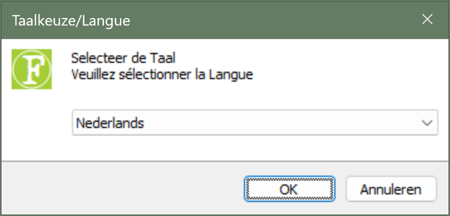

1. U ziet een introductiescherm. Klik op **Volgende**.

   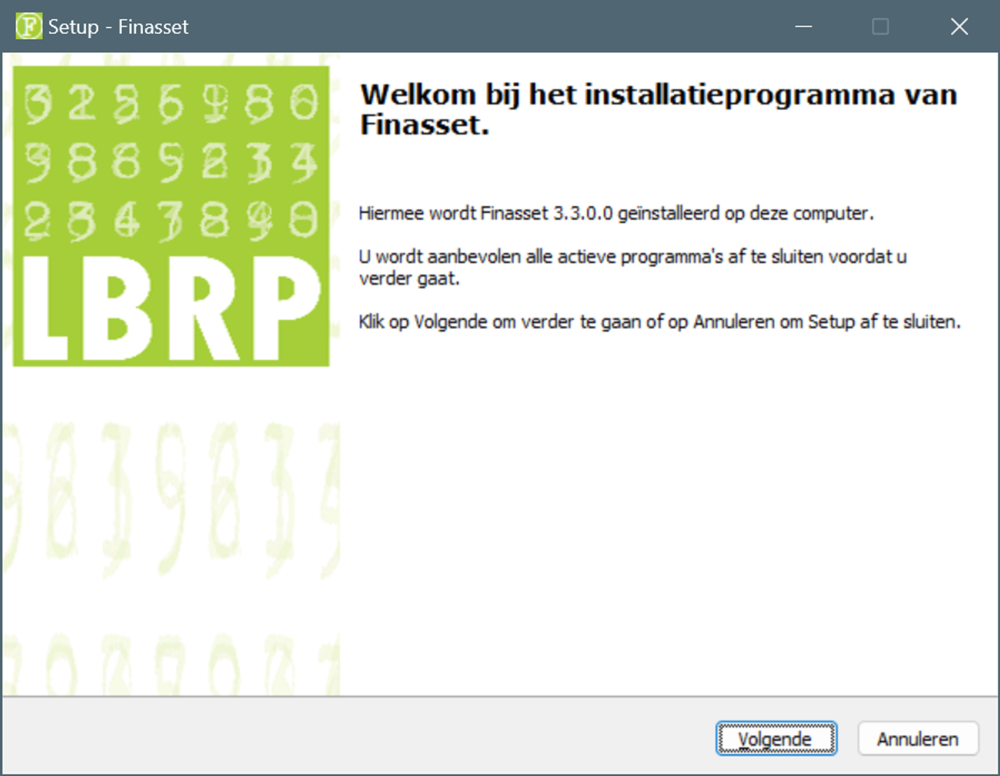

2. Accepteer de licentieovereenkomst en klik op **Volgende**. 

   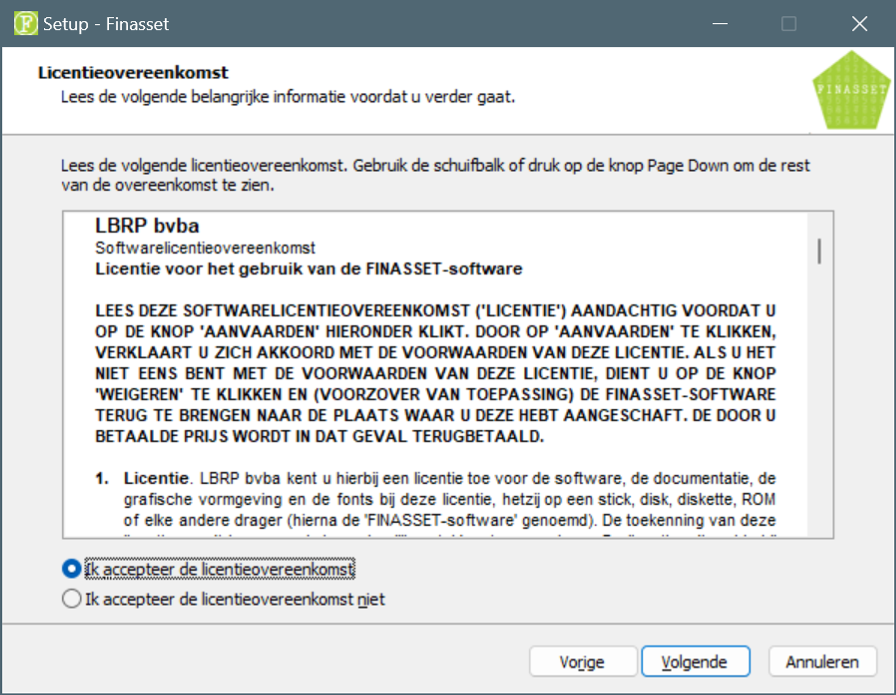

3. Vul uw **Gebruikersnaam** en **Organisatie** in en klik op **Volgende**.

   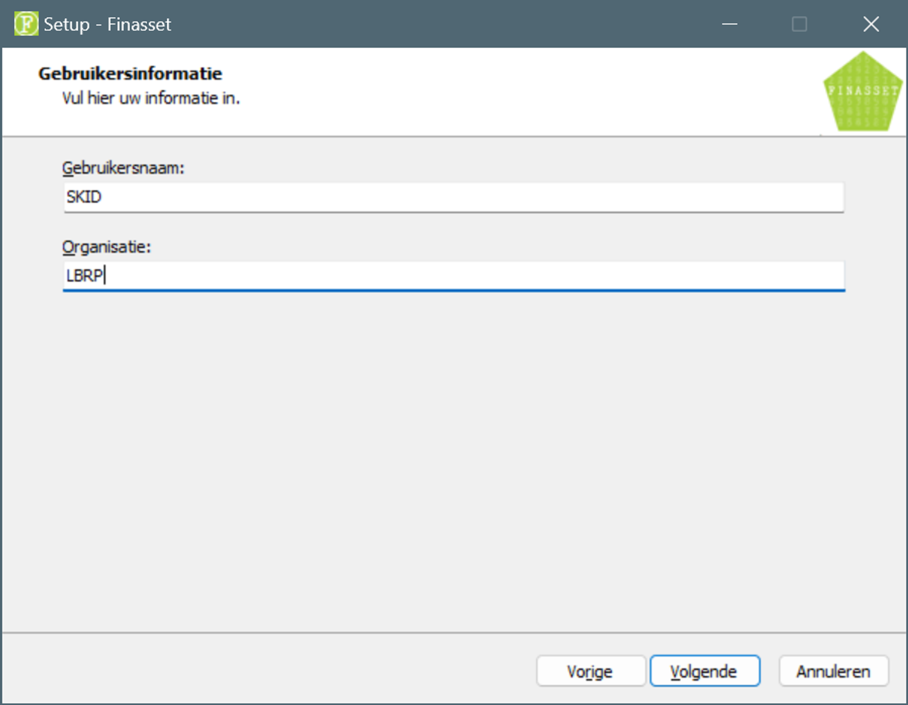

4. Kies het **Installatietype**.

   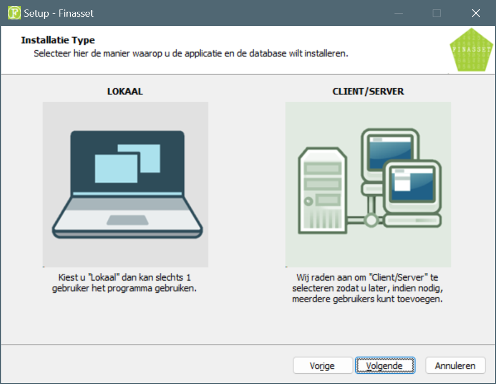

   - Mogelijke opties:

      - **Lokaal (*zonder database server, max. 1 gebruiker*)**: Voor installatie op één PC, zonder netwerkgebruik. Synchronisatie via cloud mogelijk (bijv. Dropbox). Maximaal één gebruiker tegelijk.

      - **Client en Server Installeren**: Voor installatie op een netwerkserver of meerdere PC's die via een netwerk toegang hebben tot Finasset

5. Selecteer de **Installatie Directory** en geef aan welke componenten geïnstalleerd moeten worden.

   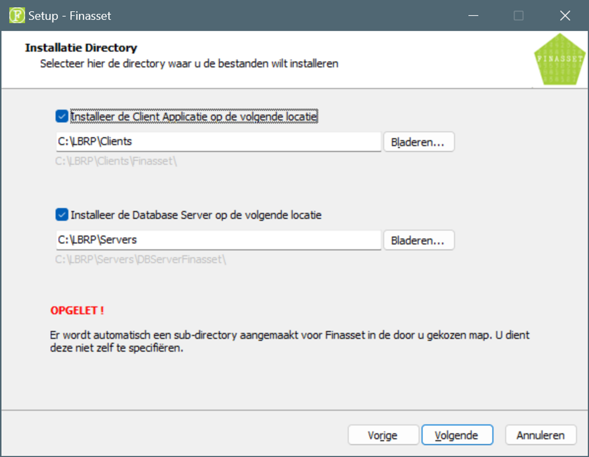

   - Mogelijke opties zijn:

     - **Client en Server installeren op dezelfde machine**: Beide vinkjes moeten aanstaan als u de **database server** en de **applicatie** op dezelfde machines wilt installeren. Dit doet u best op een server, waarbij u de database op een beschermde **C-schijf** installeerd, en de applicatie op een gedeelde **netwerk-schijf**. U kunt later de applicatie **snelkoppeling** delen met andere gebruikers.

     - **Enkel client installeren**: Deze optie moet gekozen worden als men enkel de **applicatie** wil installeren en de database server op een andere machine is geïnstalleerd of indien men kiest om op elk werkstation apart een lokale installatie te doen van de desktop applicatie. Deze optie wordt niet aangeraden omdat de installatie van updates in de toekomst dan ook op alle werkstations moet worden uitgevoerd.

     - **Enkel server installeren**: Deze optie moet gekozen worden als men enkel de database server wil installeren op de server.

6. Kies of u een **snelkoppeling** wilt aanmaken op het **bureaublad**.

   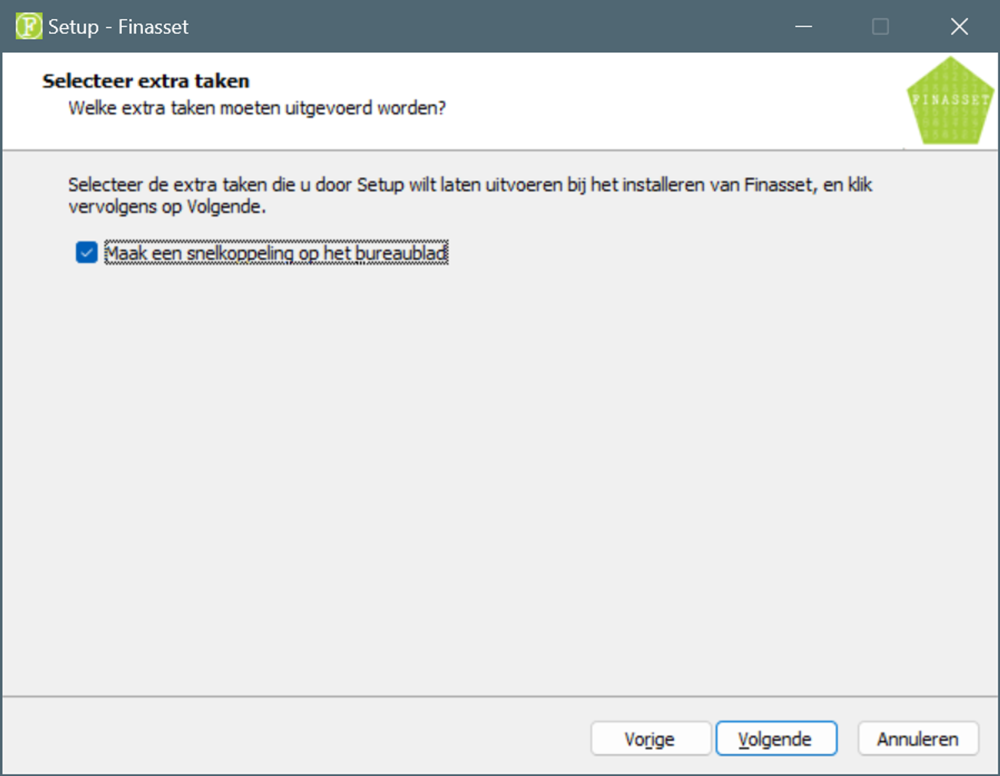

7. Bekijk het overzicht van uw keuzes en klik op **Volgende**.

   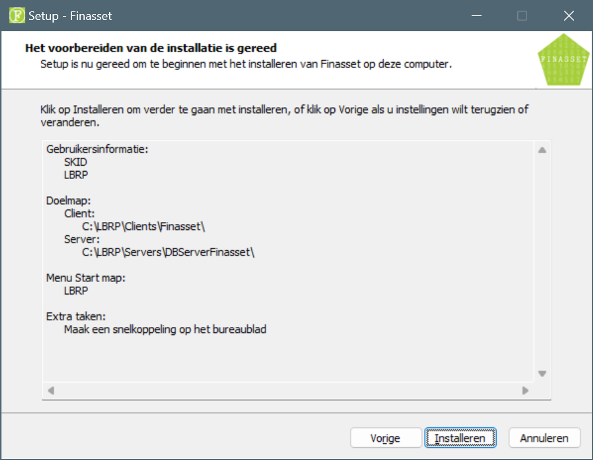

8. De installatie **kopieert** nu de nodige bestanden.

   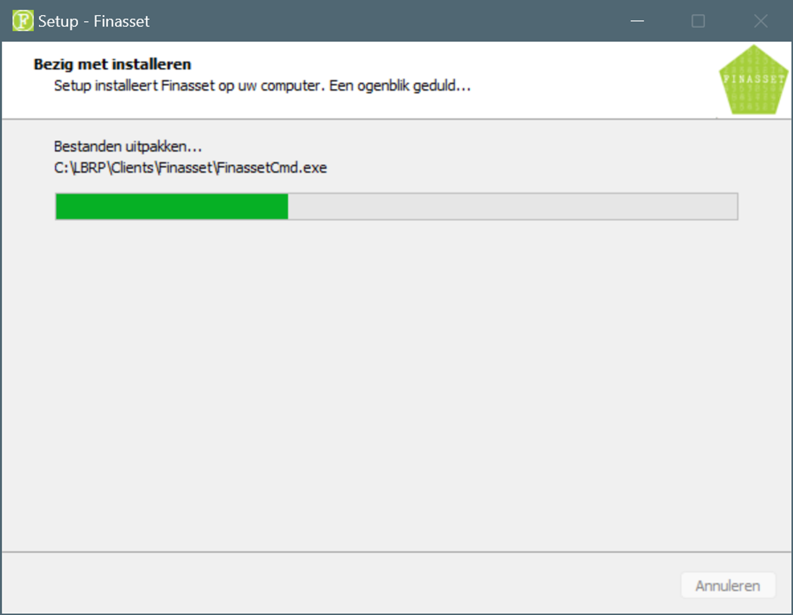

9. Kies of u het programma direct wilt **starten** na de setup.

   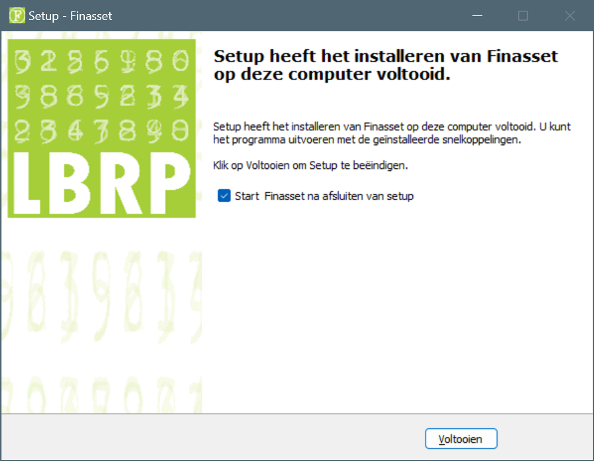

## 3. Firewall Configuratie

Tijdens de installatie is **poort 12013** automatisch geopend. Indien nodig, voeg extra firewallregels toe zodat clientcomputers verbinding kunnen maken met uw database server.

**Opmerking**: Als de applicatie en database server op dezelfde machine draaien en geen andere clients de server hoeven te benaderen, zijn geen extra firewallregels nodig.

[<strong><ins>Een firewall regel configureren op een Windows machine</ins></strong>:](https://learn.microsoft.com/en-us/windows/security/operating-system-security/network-security/windows-firewall/tools)

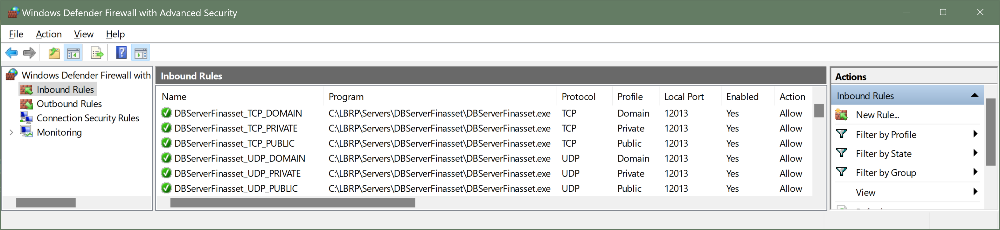

## 4. Configuratie Finasset bij eerste gebruik

### 4.1 Finasset opstarten

Start Finasset door op de snelkoppeling op het bureaublad te klikken.

### 4.2 Type connectie

Na het opstarten wordt gevraagd hoe u verbinding wilt maken:

1. **Client/Server Connectie**: Selecteer deze optie als u tijdens de installatie voor een client/server-installatie heeft gekozen.

2. **Geen Server Gebruiken**: Selecteer deze optie als u tijdens de installatie voor **lokaal gebruik (*zonder server, max. 1 gebruiker*)** heeft gekozen.

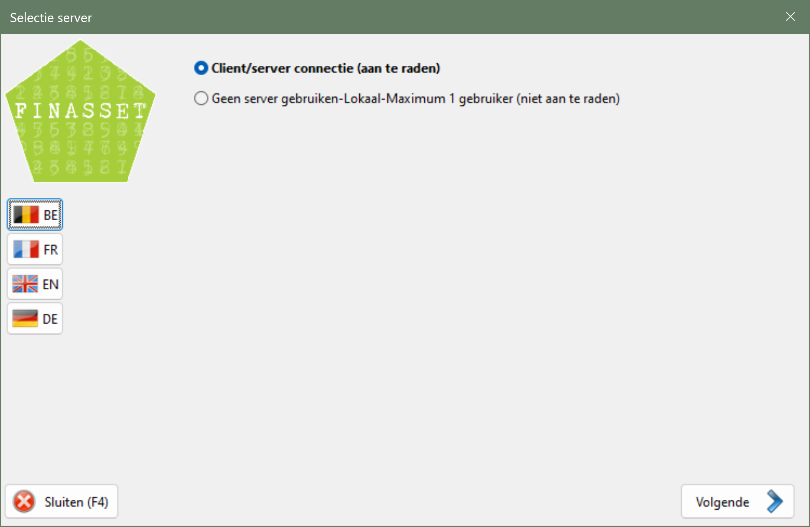

#### 4.2.1 Client/Server connectie

Voer de **servernaam** in waar Finasset is geïnstalleerd. Standaard wordt de huidige computernaam ingevuld. Wijzig de poort alleen indien nodig.

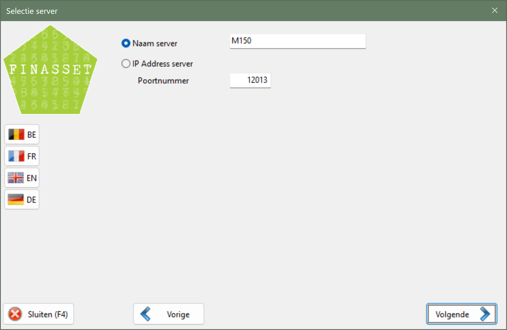

Klik op **Volgende** om te controleren of verbinding gemaakt kan worden. Bij problemen verschijnt een foutmelding.

#### 4.2.2 Geen server gebruiken

Controleer de voorgestelde locatie waar Finasset is geïnstalleerd. Pas indien nodig aan.

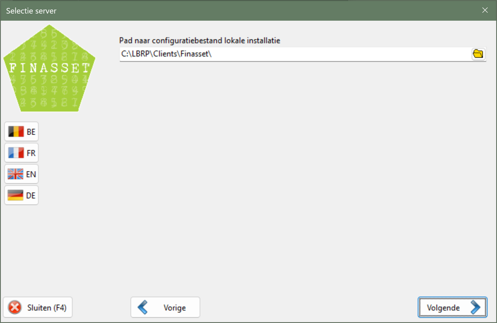

Klik op **Volgende**.

### 4.3 Aanmaken database

Als er geen bestaande Finasset-database wordt gevonden, stelt het systeem voor een nieuwe database aan te maken. Vul de naam in voor de nieuwe database of selecteer een bestaande.

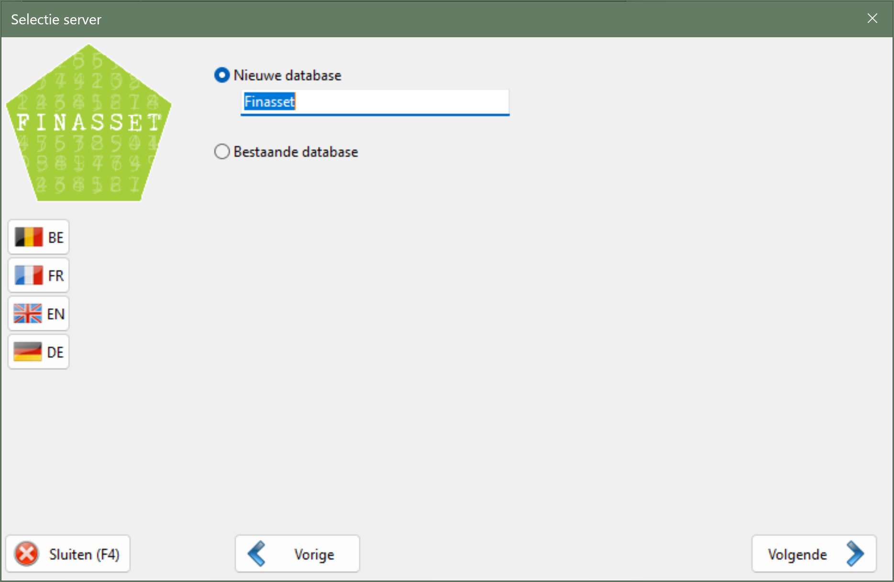

Klik op **Volgende** om de nieuwe database aan te maken. Bij succesvolle creatie verschijnt een bevestigingsscherm.

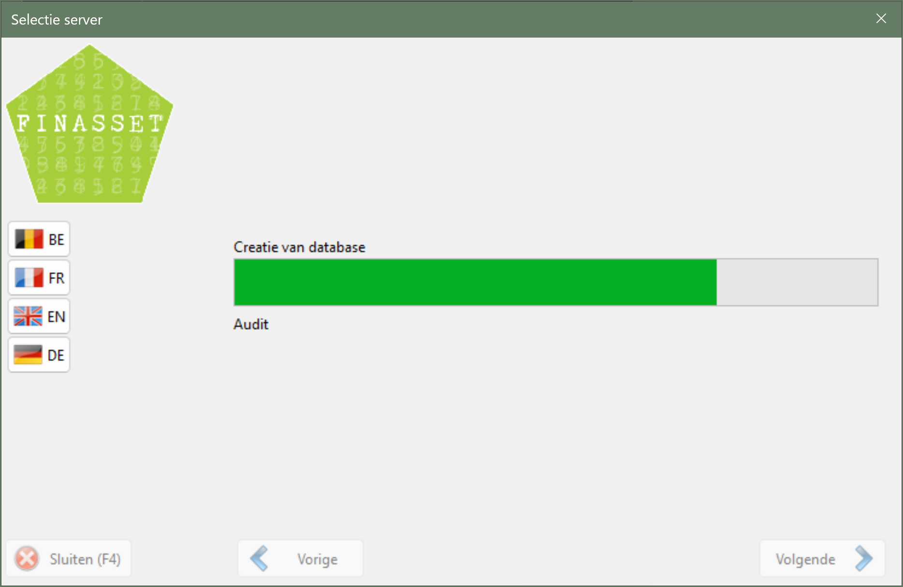

Klik op **Volgende**.

### 4.4 Configuratie bewaren

Kies **Ja** om de configuratie op te slaan voor toekomstig gebruik. Bij een volgende opstart wordt de geselecteerde server en database automatisch gebruikt.

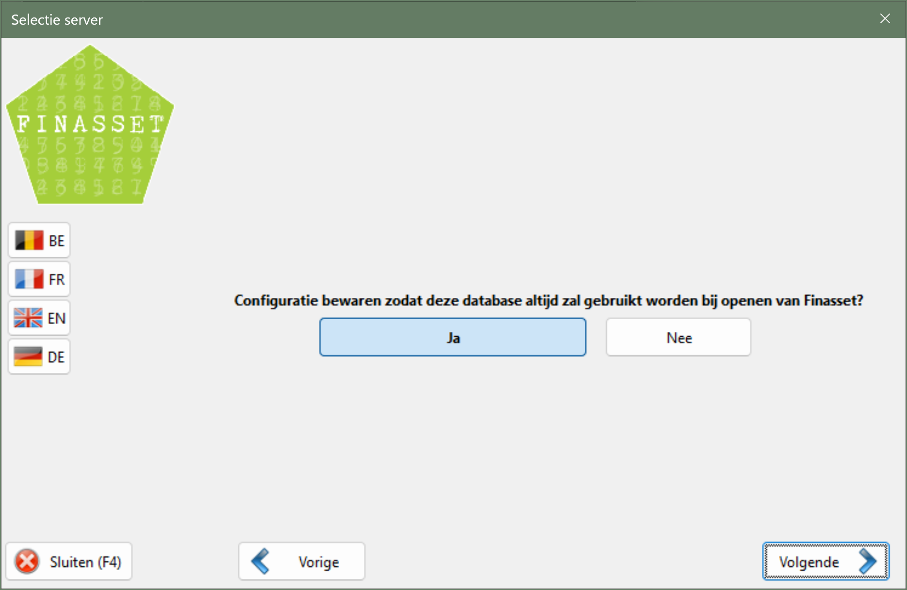

Klik op **Volgende**.

### 4.5 Einde

Na het voltooien van de configuratie wordt bevestigd dat alles goed is verlopen. Klik op **Volgende** om Finasset te starten. Bij een nieuwe installatie wordt de melding **Er is geen key ingevuld** getoond. Klik op **OK** om Finasset in demomodus te starten.

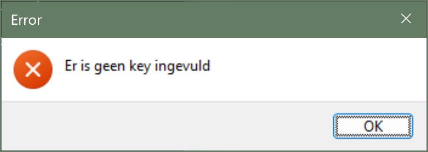

In demomodus verschijnt **Demo** op het scherm. [Hier](../License/README.md) vindt u meer informatie over het aanvragen van een licentie.

