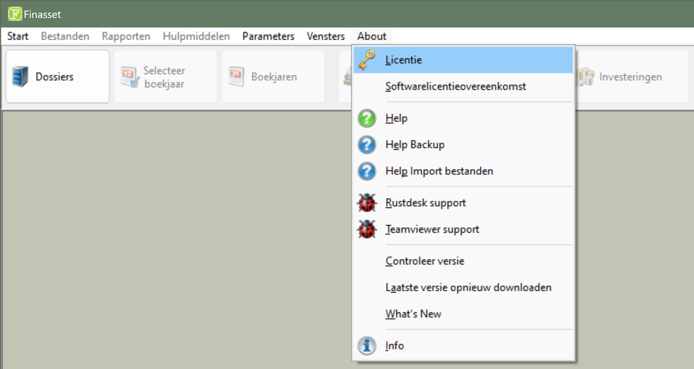
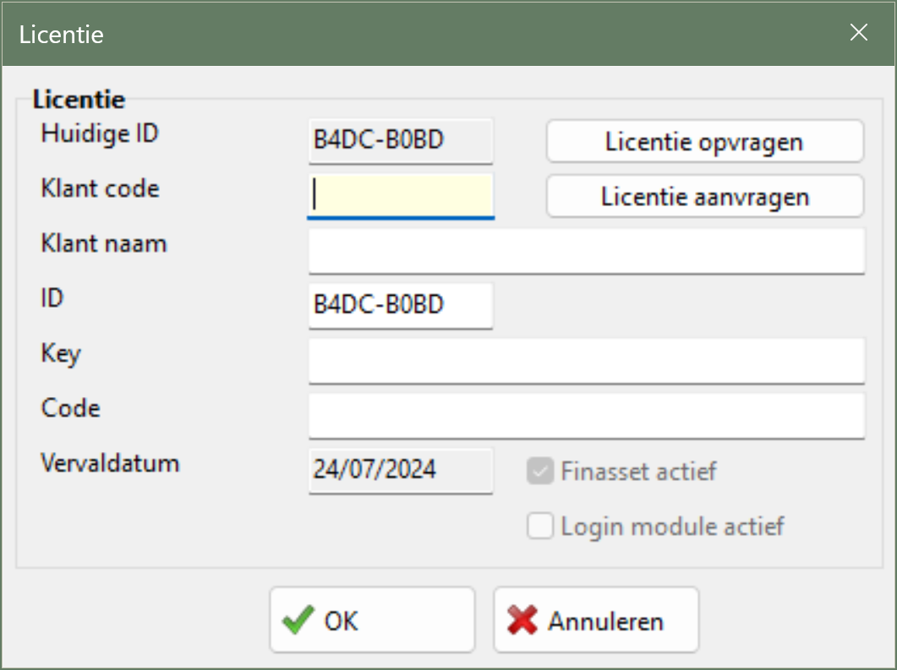
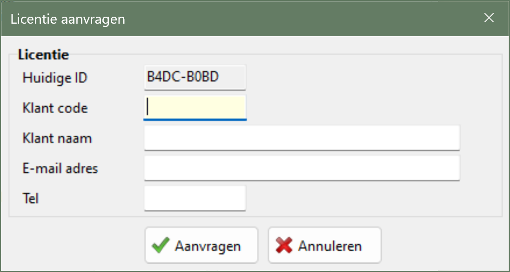
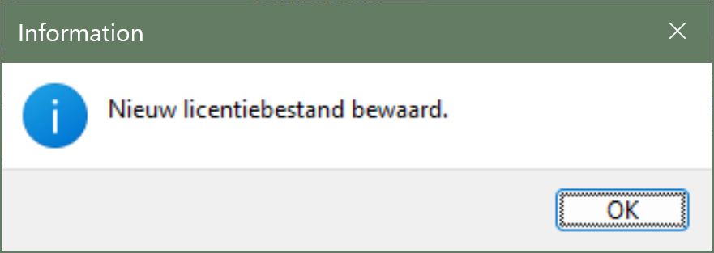

# Desktop - Finasset - Licentie

## 1. Licentie Aanvragen

Volg de onderstaande stappen om een licentie aan te vragen:

1. Start Finasset.

2. Ga naar Menu ▶️ About ▶️ Licentie.

   

3. Klik op de knop **Licentie Aanvragen**.

   

4. Vul de benodigde gegevens in. De **klantcode** vindt u op de factuur. Klik na het invullen op **Aanvragen**.

   

5. Bij een succesvolle aanvraag verschijnt de boodschap **Licentie werd aangevraagd**.

   

Licentieaanvragen worden handmatig verwerkt, dus het kan enige tijd duren voordat u uw licentie ontvangt. In de e-mail die u van ons ontvangt, staat beschreven hoe u de licentie kunt **ophalen**.

<strong><ins>Opmerking</ins></strong>:

Finasset moet toegang hebben tot het internet om een licentie aan te vragen en op te halen.