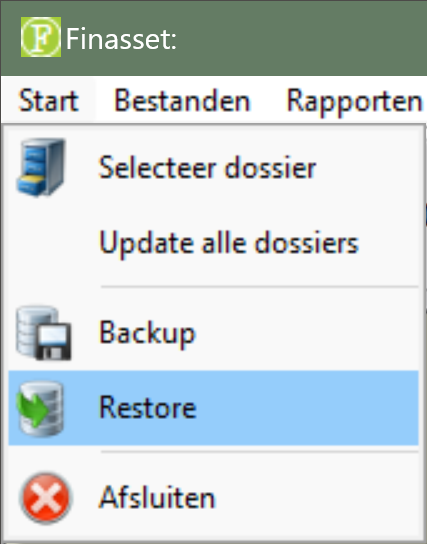
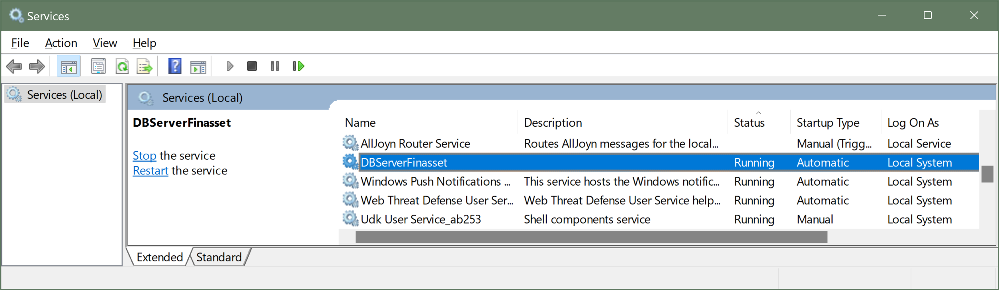

# Desktop - Finasset - Migreren

## 1. Finasset Overzetten naar Nieuwe Server

Finasset kan op twee manieren naar een nieuwe server worden overgezet:

1. Met behulp van back-up en herstel (*aanbevolen methode*)

2. Door middel van het kopiëren van bestanden

### 1.1 Overzetten met Back-up en Herstel

olg de onderstaande stappen om Finasset over te zetten met back-up en herstel:

1. Neem een [**back-up**](../BackupDatabase/README.md): menu ➡️ start ➡️ back-up.

2. Plaats het back-up bestand op een **memorystick** om deze naar de nieuwe server over te zetten. 😂 ***vroeger was dat zo...***

3. Download [**FinassetSetup.exe**](https://kutt.ctrl.corpgroup.site/finasset-latest-setup) op de nieuwe server.

4. Voer de [**installatie**](../Installation/README.md) uit op de nieuwe server.

5. **Herstel** het back-up bestand op de nieuwe server.

   

### 1.2 Overzetten door het Kopiëren van Bestanden

Deze methode wordt afgeraden omdat hierbij gegevens beschadigd kunnen raken. Gebruik deze methode alleen als de back-up en herstel methode niet mogelijk is.

Stappenplan:

1. [**Download**](https://kutt.ctrl.corpgroup.site/finasset-latest-setup) en [**installeer**](../Installation/README.md) `FinassetSetup.exe` op de nieuwe server. 💡 *Installeer Finasset op dezelfde locatie als op de oude server*.

2. Stop de service **LBRP Database Server** op de nieuwe server:

   - Open het **Configuratiescherm** van Windows.

   - Dubbelklik op **Systeembeheer**.

   - Dubbelklik op **Services**.

   - Klik met de rechtermuisknop op de service **LBRP Database Server** en kies **Stoppen**.

      

3. Kopieer de map van de oude server naar de locatie op de nieuwe server.
4. Start de nieuwe server opnieuw op.
5. Bij het starten van Finasset zou de oude data weer zichtbaar moeten zijn.

## 2. Finasset Overzetten van Server naar NAS

Finasset kan draaien op een server maar ook op een NAS. Het nadeel van werken op een NAS is dat Finasset trager werkt en dat maar één persoon tegelijk de data kan aanpassen.

Volg deze stappen om Finasset over te zetten van server naar NAS:

1. Neem een back-up van Finasset op de server (start Finasset, menu ➡️ start ➡️ back-up).

2. Plaats het back-up bestand op een memorystick.

3. Deïnstalleer Finasset van de server en de clients als deze in de toekomst Finasset vanaf de NAS gaan gebruiken.

4. Download [FinassetSetup.exe](https://kutt.ctrl.corpgroup.site/finasset-latest-setup) van onze website.

5. Kies tijdens de installatie voor **Lokaal (*zonder server, max 1 gebruiker*)** en selecteer de locatie en map op de NAS-schijf waar Finasset moet komen.

6. Start Finasset na de installatie en kies voor de optie **Geen server gebruiken - Lokaal - Maximaal 1 gebruiker** en volg de wizard.

7. Na de installatie kunt u via menu ➡️ **restore** het back-up bestand selecteren en **herstellen**. Dit zal de back-up terugzetten op de NAS.
