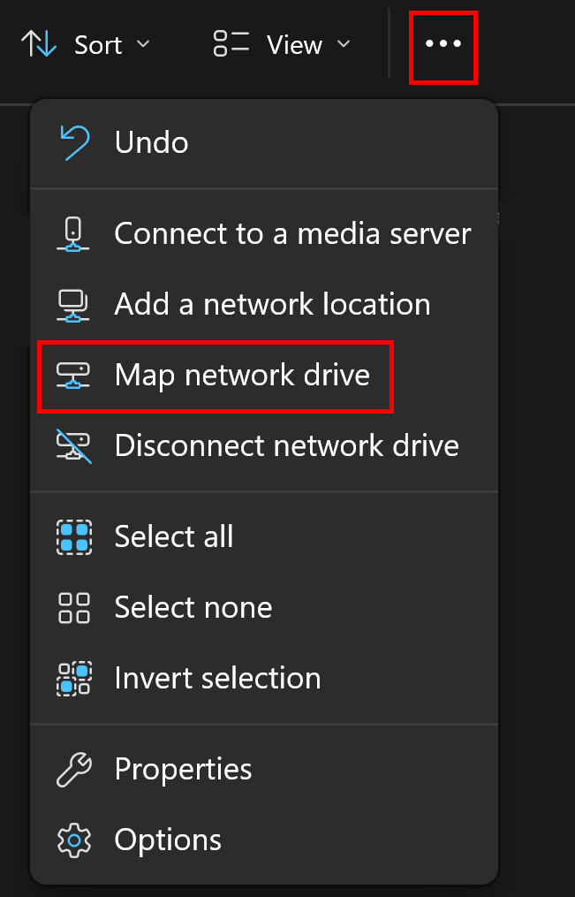
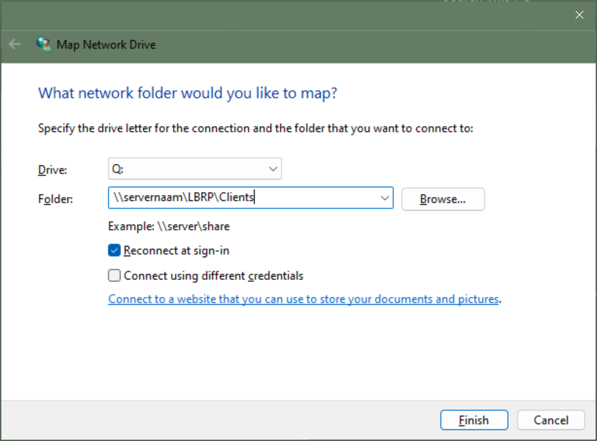

# Desktop - Finasset - Applicatie Delen

## 1. Finasset Client Map Delen op de Server

Als u Finasset op meerdere computers (*werkstations*) wilt gebruiken, moet er een map op de bestandsserver worden gedeeld zodat alle computers de Finasset client kunnen opstarten. Als u de Finasset client al hebt geïnstalleerd in een bestaande gedeelde map, hoeft u geen nieuwe gedeelde map aan te maken en kunt u doorgaan naar stap 2.

De Finasset client moet in een gedeelde map op de bestandsserver staan. Als dit nog niet het geval is, deel dan de map `C:\LBRP\Clients` (*of de map waar u de Finasset client hebt geïnstalleerd*) op de bestandsserver, zodat andere gebruikers toegang hebben tot deze map.

[<strong><ins>Map a network drive in Windows</ins></strong>](https://support.microsoft.com/en-us/windows/map-a-network-drive-in-windows-29ce55d1-34e3-a7e2-4801-131475f9557d)

<strong><ins>Opmerking</ins></strong>:

Er is geen aparte clientinstallatie nodig op een werkstation dat Finasset wil gebruiken. Volg gewoon de onderstaande procedures om Finasset op andere werkstations te gebruiken.

## 2. Netwerkmap Koppelen op Werkstation

Als de servermap waar de Finasset client zich bevindt al is gekoppeld op de client, hoeft u deze procedure niet uit te voeren en kunt u doorgaan naar stap 3.

<ins>Procedure om een netwerkmap te koppelen op een werkstation/client:</ins>:

1. Open **Windows verkenner**.

2. Menu ➡️ Extra ➡️ **Netwerkverbinding maken**.

   

3. Kies een ongebruikte letter bij **Drive**.

4. Vul bij **Folder** `\\servernaam\gedeeldemap` in, waarbij:

    - **servernaam** de naam is van de server.
    - **gedeeldemap** de naam is van uw gedeelde map.
       - Bijvoorbeeld: `\\servernaam\LBRP\Clients` en het vinkje **Opnieuw verbinden bij aanmelden** moet u aanzetten.

   

<strong><ins>Opmerking</ins></strong>:

Gebruik op alle clients dezelfde gedeelde **Drive**-letter.

# 3. Snelkoppeling naar Finasset Client

Om een snelkoppeling naar de Finasset client toe te voegen op uw bureaublad, volgt u deze stappen:

1. Open **Windows Verkenner**.

2. Open de map `Q:\Finasset\`

3. Klik met de rechtermuisknop op het bestand `Finasset.exe`.

4. Kies **Kopiëren naar** ➡️ **Bureaublad** (*snelkoppeling maken*).
